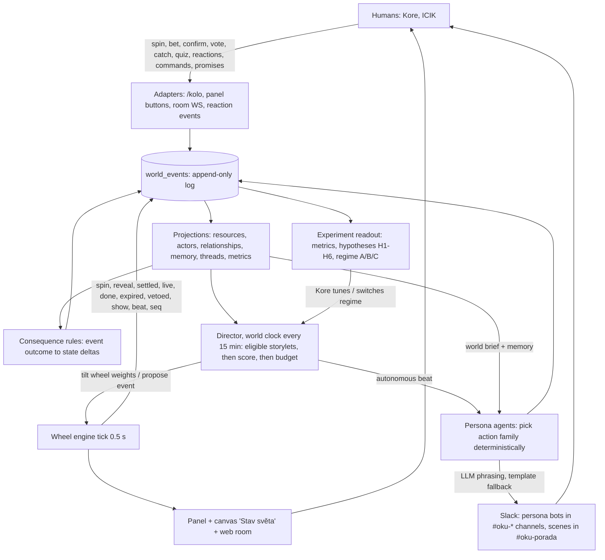
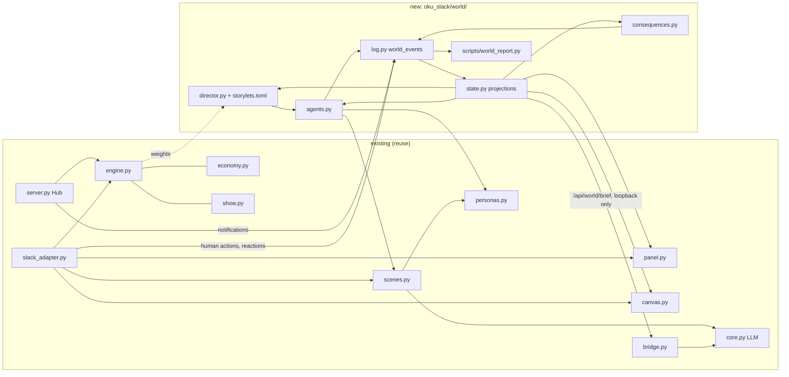
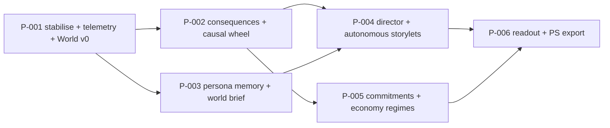

# OKÚ Event Ecosystem Plan: audit + design for a small living world

Status: PROPOSAL (uncommitted draft for Kore). Written 2026-10-08 on branch `feat/wheel-of-fortune` (PR #2, HEAD `54f7fe3`).
Scope: read-only audit of the oku-slack "event arsenal", then a phased design that turns it into a small living ecosystem that doubles as an experiment for future POST SCARCITY events.
Method: code reading (file:line refs below), full pytest run, read-only inspection of `logs/wheel.sqlite3` (opened `mode=ro`), the Heimdall console log `C:\code\heimdall\logs\console\oku_wheel.log`, `logs/usage.jsonl`, `logs/oku_slack.log`, and HTTP GETs on the live room. No code, service, Slack message, or commit was changed or sent.
Anything not verified is marked **UNKNOWN**.

---

## 0. TL;DR

- The arsenal is large and well tested (**128 tests pass**), but in production **no wheel event has ever gone live**: all 7 spins in the DB ended `expired` because every event needs **all** players (Kore and ICIK) to confirm (`engine.py:149`). So scenes, the live show (poll, Chyť dotaci, quiz), the hype meter and the Titanic legend have only ever run in tests.
- The Slack panel has a bigger problem than "one failed update per event": the console log has **2,072 `panel update failed: invalid_blocks`**, including **2,064 in a row** (2026-10-08 01:26–05:15) while the wheel was idle. Hard errors get no backoff (`panel.py:196`), and Slack's `response_metadata` isn't logged, so the root cause is **UNKNOWN**.
- Today the events don't change anything that persists except OKÚ korun, and korun only drain (3 lost bets, −350; one confirm bonus, +50). Characters have no memory or world awareness. The five persona channels are unused. There's no telemetry stream.
- POST SCARCITY needs causal events (spawned from state, not dice), actors with memory, bonds and obligations, reputation as witnessed acts (never as spendable credit), failure without game over, an append-only event log with projections, and a director that only picks *eligible* storylets. It also explicitly forbids currency, XP and cooldown scarcity.
- Proposal: a small **OKÚ World** layer inside the existing `oku_wheel` process. It has an append-only `world_events` log, projections (resources, actors, relationships, memory, threads), consequences for every event outcome, a budgeted storylet director, persona agents that remember, and an **economy-regime experiment** (A scarce korun → B abundant korun → C no currency, reputation as witnessed acts). That last part tests a central POST SCARCITY question with real humans.
- Six phases (P-001…P-006), about **8–11.5 dev-days** in total (estimate, UNVERIFIED). P-001 adds no new channel messages.

---

## 1. Audit: inventory of event mechanics

### 1.1 Where things live

| Area | Files |
|---|---|
| Wheel service (Heimdall `oku_wheel`, `.venv-wheel`, :8797) | `oku_slack/wheel/{engine,economy,effects,show,store,config,server,slack_adapter,panel,canvas,scenes,personas,render}.py`, `scenes.toml`, `host.toml`, `events/titanic.toml`, `static/room.html`, `players.toml` (+ untracked `players.local.toml`) |
| Persona bridge (Heimdall `oku_slack`, `.venv`) | `oku_slack/{bridge,core,meeting,followup,moderation,usage}.py`, `config.toml`, `persona/*` |
| Ops | `scripts/run-wheel-room.ps1`, `scripts/deploy-wheel-room.ps1`, `C:\code\heimdall\services.d\oku_wheel.toml` (autostart, health `GET /api/state`), `oku_wheel_tunnel.toml` (named tunnel `kolo-ws.itzkore.cz` → :8797), `oku_slack.toml` |
| State | `logs/wheel.sqlite3` tables `events, cooldowns, sequences, kv, chat, ledger, bets` (`store.py:4-12`); kv keys `canvas_id, panel_channel, panel_ts, round, scene:<id>, scene_extra:<id>, shield:<p>, double:<p>`; `logs/capak_followup.json`; `logs/usage.jsonl` |
| Tests | `tests/test_wheel*.py` (71 tests), `test_meeting.py` (12), `test_oku.py` (15 + parametrised = 20), `test_moderation.py` (10), `test_usage.py` (9), `test_followup.py` (6) |

### 1.2 Mechanics table

Status legend: **LIVE** = running in production and evidenced. **LIVE-UNPROVEN** = code is wired in production, but its trigger has never fired. **BROKEN** = observed failing. **DEAD** = not reachable in production. **DONE** = finished one-off.

| # | Mechanic | Trigger | State kept | Status | Evidence |
|---|---|---|---|---|---|
| 1 | Wheel state machine `pending→ready→live→done`, `expired`, `vetoed` | `/kolo toc`, panel 🎡, room WS `spin`, 0.5 s tick | `events` (JSON blob per event) | LIVE, but 7/7 production events `expired` | `engine.py:6-9,117-141,252-300`; DB: 7 events, all expired (kantyna×3, socky×3, porada×1); `test_wheel.py` (14) |
| 2 | Deliberate confirmation (4-char code or server-timed hold), **all players required** | modal / room | `event.confirmed` | Works as coded; it's the production blocker | `engine.py:144-172` (gate `:149`); only 3 of 14 required confirmations ever happened (DB); `test_not_live_without_all_players` |
| 3 | Monika host lines (spin/result/alarm/nag/expiry/legendary/bets) | engine events | `event.host_say` | LIVE (panel + canvas). Only the 5-min alarm is a channel post | `engine.py:55-63,274-285`; `host.toml`; `slack_adapter.py:163-166` |
| 4 | Betting round (30 s window → auto-spin → settle at reveal) | 🎡 Točit, `/kolo sazka` | kv `round`, `bets`, `ledger` | LIVE (3 bets, all lost) | `engine.py:66-92,256-273`; `economy.py:37-79`; `test_betting_window_spin_and_payout` |
| 5 | OKÚ korun ledger + leaderboard | bets, confirm, show minigames | `ledger` | LIVE; in practice sink-only (−350 bets, +50 confirm; Kore 750, ICIK 950 via `/api/state`) | `economy.py:15-34`; DB ledger |
| 6 | Charged command + effect registry (`veto_respin, steal_points, double_bet, persona_interrupt, shield`) | ⚡ panel, `/kolo prikaz`, room WS `command` | `cooldowns`, `sequences`, kv `shield:*`, `double:*` | LIVE (1 cooldown + 1 sequence in DB) | `engine.py:175-206`; `effects.py:9-60`; `test_veto_respin_*`, `test_steal_points_*`, `test_double_bet_*` |
| 7 | 2-min sequence narration | after a command | `sequences` | LIVE | `engine.py:12,196-205,293-299`; `test_sequence_shows_effect_live_in_panel` |
| 8 | Live show: poll, "Chyť dotaci", quiz | event `live` | `event.show` | LIVE-UNPROVEN (no live event ever) | `show.py:8-67`; `engine.py:209-242`; `test_poll_catch_quiz_points_and_panel`, `test_minigames_only_when_live` |
| 9 | Hype meter from reactions | `reaction_added/removed` on panel or scene messages | `event.show.hype` | LIVE-UNPROVEN. Handlers registered; log shows `scopes changed: +chat:write.customize,reactions:read` | `slack_adapter.py:201-209,281-285`; `test_hype_counts_reactions_on_panel_and_scene_only` |
| 10 | Persona scenes (LLM per beat, template fallback, resume after restart) | event `live` | kv `scene:<id>` | LIVE-UNPROVEN: 0 `scene:*` keys, 0 `wheel_scene` rows in `usage.jsonl` | `scenes.py:29-132`; `scenes.toml` (7 scenes); `test_scene_*` (5) |
| 11 | Legendary "Mimořádná schůze sněmovny" / Titanic (12 beats, room cinematic, poster) | weight 0.15 or forced | `event.beat` | LIVE-UNPROVEN | `events/titanic.toml`; `engine.py:289-313`; `test_wheel_legendary.py` (10) |
| 12 | Persona interjection (`persona_line`) | effects | kv `scene_extra:<id>` | UNKNOWN whether it has posted. It's only stored when an event is active; none was live | `scenes.py:138-156`; `effects.py:27,34,48` |
| 13 | Slack control panel (one Block Kit message, choreography drums→GIF→card) | any state change, ≥1 s throttle, 60 s refresh | kv `panel_ts` | LIVE but **BROKEN in bursts**: 2,072 `invalid_blocks` in the console log, 2,064 consecutive on 2026-10-08 01:26–05:15 (wheel idle) | `panel.py:177-250`; `oku_wheel.log` |
| 14 | Per-event result card (`files_upload_v2` → `slack_file` image block) | phase `result` | in-memory `cards` | KNOWN BUG: first update per event fails, then falls back to the static card | `panel.py:199-207,238-239`; `test_card_fallback_on_invalid_blocks` |
| 15 | Live canvas "OKÚ Kolo · živě" | change (≥3 s), 60 s refresh | kv `canvas_id` | LIVE (`canvas created` after `not_in_channel`/`missing_scope` retries). No v2 content (bets, board, show); `set_image` never called | `canvas.py:23-59,69`; grep: no caller of `set_image` |
| 16 | Wheel imagery (PNG, per-segment spin GIF, cards, Titanic poster) | `deploy-wheel-room.ps1` (pre-rendered) | static files on itzkore.cz | LIVE (HTTP 200 for `kolo.png`, `card-socky.png`, `kolo-spin-socky.gif` 1.7 MB, `titanic.png` on 2026-10-08). The GIF is per segment, not per spin | `render.py:161-246`; `panel.py:43-52` |
| 17 | Public web room + WS (spectator/player, clock-synced, music, chat) | browser | `chat` table | LIVE via `wss://kolo-ws.itzkore.cz/ws` (`/api/state` 200 through the tunnel). WS supports only `spin, code, hold_start/end, command, chat`. Room spin bypasses betting | `server.py:64-72`; `room.html:128-137` |
| 18 | `/api/state`, `/wheel.png`, `/poster.png` | HTTP | n/a | LIVE and **public through the tunnel** (code stripped for spectators; board, bets, chat visible) | `server.py:106-120`; `engine.py:321` |
| 19 | `notification()` channel texts (spin/reveal/nag/live/done…) | none in production | n/a | DEAD in production (tests only); `make_poster` replaced it | `slack_adapter.py:125-140`; used only in `test_wheel.py:108`, `test_wheel_legendary.py:90-93` |
| 20 | Meeting mode "porada" (turn-based, Babiš chairs) | ≥2 persona mentions or the word "porada" | in-memory | LIVE (meeting turns in `oku_slack.log`; 24 `meeting` usage rows) | `meeting.py:22-241`; `test_meeting.py` (12) |
| 21 | Solo persona replies | mention / DM | none (thread history only) | LIVE (52 `solo` usage rows) | `bridge.py:59-78` |
| 22 | Čapák follow-up | anchor post | `logs/capak_followup.json` | DONE (`"done":"timeout"`), still `enabled = true` | `followup.py`; `config.toml:69-76` |
| 23 | Moderation invite/kick | owner command | none | LIVE (not an event mechanic) | `moderation.py`; `test_moderation.py` |
| 24 | Usage accounting + DM reports | every LLM call | `logs/usage.jsonl` | LIVE (76 rows since 2026-10-07 10:49, est. ~$0.018) | `usage.py` |
| 25 | Per-persona channels (#oku-dotace-desk, kantyna, socky, disko, vina) | none | `config.toml [channel_defaults]` | Documentation only; no event uses them | `config.toml:7-14` |

### 1.3 Tests

- `.venv-wheel\Scripts\python.exe -m pytest -q -p no:cacheprovider` → **128 passed, 2 warnings in ~15.6 s**. Both warnings are aiohttp `NotAppKeyWarning` at `server.py:79` (`app["hub"]`).
- The command in the README (`README.md:11`, `.venv\Scripts\python.exe -m pytest -q`) → **6 collection errors**, because `.venv` has no Pillow (all `test_wheel*` modules).
- `run-wheel-room.ps1 -Test` runs only `tests/test_wheel.py` (14 of 128) (`scripts/run-wheel-room.ps1:14`).
- No tests for: Slack `response_metadata` handling, panel backoff under persistent errors, WS `bet`/show messages (they don't exist), multi-day economy drift, or a full live event end to end with real Slack payload shapes.

### 1.4 Recent event work (git)

All of the wheel work landed on 2026-10-07 between 15:10 and 19:15 (+02:00), in 14 commits from `b67cbba` (pure engine) to `54f7fe3` (Macinka via the Peťa bot). The running server (PID started 2026-10-07 19:15:25) is newer than HEAD (19:15:15), so production runs HEAD (inferred from timestamps). `origin/main` is at `320d50c`. The branch is in sync with `origin/feat/wheel-of-fortune` (0/0).

### 1.5 Bugs and risks, by priority

| ID | Severity | Finding | Evidence | Suggested fix |
|---|---|---|---|---|
| B1 | **High (design)** | The all-players confirmation gate means nothing ever goes live (7/7 expired), so every downstream feature is unproven | `engine.py:149`; DB | Configurable `confirm_quorum` (e.g. 1) or opt-in participation (whoever confirms is "in"). **Decision D1** |
| B2 | **High** | Panel retries a non-soft error every ~1 s forever (only SOFT codes get `retry_s`). Thousands of failed `chat.update` calls; root cause invisible | `panel.py:193-197,236-240`; 2,064 consecutive failures in `oku_wheel.log` | Log `e.response["response_metadata"]["messages"]`. Exponential backoff for repeated identical errors. After N `invalid_blocks`, degrade to a text-only panel |
| B3 | Medium | `slack_file` card fails on the first update per event (file uploaded without a channel, likely not yet processed; root cause UNVERIFIED) | `panel.py:199-207,238-239` | Serve the card from the static host or a `/card/<id>.png` route and use `image_url`, or poll `files.info` before using `slack_file` |
| B4 | Medium (economy) | Korun only drain (house edge 10%, faucets only fire on live events). Bankruptcy is the stable end state | `economy.py:41`; DB ledger | Becomes the experiment's Regime A baseline (Section 3.6); add a world-pool faucet |
| B5 | Low | `double:<p>` is consumed at any settled round, even if that player placed no bet in it | `engine.py:268-270` | Consume only if the player has a bet in `round_id` |
| B6 | Medium | Room and Slack have different rules: room `spin` skips the betting window; room has no bet/poll/catch/quiz | `server.py:66`; `room.html:128-137` | Route room spin through `open_bets`; add WS `bet`, `vote`, `catch`, `quiz` |
| B7 | Medium | `allow_force = true` in the committed production config, and the public room shows "Vynutit legendu" | `players.toml:13`; `room.html:129` | `false` in production; force via an owner-only command |
| B8 | Low | Docs and scripts out of date: README test command; WHEEL.md says `autostart = false` (manifest says `true`); WHEEL.md describes the thread GIF / PNG posting that the panel replaced; "Open items" already resolved; deploy script auto-detects a *quick* tunnel (now a named tunnel, so `-WsUrl` is needed); comment "Babiš app tokens" | `README.md:11`; `docs/WHEEL.md:56,60,77,84`; `deploy-wheel-room.ps1:2,8-16`; `server.py:139` | Doc sweep in P-001 |
| B9 | Low | Canvas lags behind v2: no bets/board/show; `STATE_CZ` lacks `vetoed`; `set_image` is dead | `canvas.py:11,23-59,69` | P-001 adds a "Stav světa" section and the v2 fields |
| B10 | Low | Duplication: 4 persona-name maps; 4 copies of the Slack-error helper; dead `notification()` next to `make_poster` | `engine.py:29-31`, `slack_adapter.py:9`, `panel.py:13`, `personas.py:11`; `_err/_code` in `canvas.py:13`, `panel.py:21`, `personas.py:21`, `slack_adapter.py:142` | One `names.py` + one `slack_err()` |
| B11 | Low | The tick deserialises every event and sequence each 0.5 s (`store._all`), so cost grows linearly | `engine.py:263,293`; `store.py:25-27` | Index active rows / state column when adding `world_events` |
| B12 | Low | Finished one-off follow-up is still enabled | `config.toml:70-71`; `capak_followup.json` | Set `enabled = false` |
| B13 | Info | New HTTP routes on :8797 are public by default, because the named tunnel forwards every path | `oku_wheel_tunnel.toml`; `server.py:115-121` | Any `/api/world*` route must reject tunnelled requests (loopback-only check, e.g. reject when `CF-Connecting-IP` is present) |

### 1.6 Missing glue (what stops the arsenal from being an ecosystem)

1. **No consequences.** `done` and `expired` change nothing except korun. Nobody remembers a missed porada.
2. **No world model.** No resources, relationships or memory. Persona prompts are static profile files (`core.build_prompt`, `core.py:14-23`); bridge replies don't know the wheel exists.
3. **Random, not causal.** Static weights in `players.toml`; nothing in the state changes what happens next.
4. **No telemetry stream.** Events are mutable JSON blobs. Human actions (bets, votes, reactions, confirmations) leave only side effects, so the experiment can't be measured.
5. **No cadence.** Only the 0.5 s tick and human triggers; no slower "world clock" (hourly/daily) and no quiet hours.
6. **Unused stages.** The five persona channels exist and the bots are members, but nothing happens there.

---

## 2. What POST SCARCITY events need (from `C:\code\post-scarcity`)

| Concept | What the PS repo says | Source |
|---|---|---|
| Material abundance, scarce meaning | "Všeho je dost, ale smysl je vzácný." No currency, purpose points, XP, loot, or scarcity disguised as energy/cooldowns | `odin/plans/02-worldbuilding/02.1-post-scarcity-premise.md:9`; `README.md:32`; `SYSTEM.toml` PS-R1 |
| Reputation is not credit | "Never implement reputation as spendable credit." Reputation = witnessed acts interpreted by an audience; no universal score | `SYSTEM.toml` PS-R3; `AGENTS.md:11`; `design/mechanics.md:59`; `design/systems/communication-rumor.md:72-82` |
| Causal events | Authored events need world-state preconditions; crisis = vulnerability + trigger + people/place + context + timing; lifecycle LATENT → … → AFTERMATH → REVIEW | `AGENTS.md:12`; `design/systems/crisis-incident-engine.md:10-52` |
| Actors | Persistent values, desires, fears, limits, bonds, obligations, beliefs, plans, salience. Avoid a single `trust = 73`. Act only on what they could know. The LLM verbalises; deterministic logic validates | `design/systems/actor-simulation.md:13-82` |
| Event store + projections | Append-only events (id, type, world_time, sequence, source, payload, causal_parents, rule/content version), rebuildable projections, side-effect-free queries | `design/engine/event-store-projections.md:19-69` |
| Deterministic RNG | Separate streams (WORLD, ACTORS, INCIDENTS, DIRECTOR, COSMETIC…), keyed draws, recorded seeds | `design/engine/deterministic-rng.md:21-77` |
| Rules kernel | Pure predicates (ALL/ANY/NOT/COUNT…), requirements with explanations, effects as validated event drafts | `design/engine/rules-kernel.md:20-73` |
| Fate Threads, storylets, Director | Threads SEED → ECHO → PRESSURE → CROSSROADS → PAYOFF → SCAR; storylets with `requires/boosts/blocks`; Director picks only causally eligible storylets, then scores them; trigger families incl. EVENT, STATE, RELATIONSHIP, ABSENCE, TIME | `design/narrative-causality-engine.md:250-435` |
| World memory | Causal history vs official record vs public narrative vs private memory, which can disagree | `design/systems/world-memory-historical-record.md:23-60` |
| Failure without game over | "Continue with the consequences": failure record with losses, new constraints, new opportunities, recovery routes | `design/systems/failure-without-game-over.md:8-74` |
| Time | No action points, no hidden real-time pressure; scheduled events with prerequisites/cancel conditions; deterministic ordering | `design/systems/time-and-schedule.md:8-68` |
| Precedent | "Every policy was once somebody's case": a resolution becomes a precedent, then a policy | `design/systems/precedent-policy.md:4-69` |
| Debuggability | God view: why did this storylet fire, why does X know Y | `design/engine/debug-causality-inspector.md:8-68` |
| Local AI only | Game inference goes through Nautilus → Bonsai → Ollama, never the cloud; deterministic fallback | `SYSTEM.toml` PS-R11, PS-R12 |

Tensions to be honest about:
- OKÚ deliberately has a currency (korun), cooldowns and bets, which PS forbids. The design below treats them as the **scarcity baseline** of an experiment rather than hiding them.
- OKÚ uses Gemini (cloud), while PS requires local inference. LLM findings won't transfer one-to-one (Decision D5).
- The `odin/plans/02-worldbuilding/02.5-economy-access.md` draft lists "Continuity Index / Service Credits / Civic Score", which conflicts with PS-R1/PS-R3. Testing a non-currency regime in OKÚ (Regime C) produces evidence on exactly that open question.

---

## 3. Design: the OKÚ World

### 3.1 Principles

1. **Reuse first.** The world lives in the existing `oku_wheel` process, which already owns the tick loop, SQLite, the Kolo Slack app, PersonaPoster and the LLM path. No new Heimdall service in phases 1–5.
2. **Append-only truth.** Every engine notification and every human action becomes one `world_events` row. Everything else is a rebuildable projection (PS event-store doc).
3. **Events come from state.** Randomness only picks among eligible options, through keyed, recorded draws.
4. **The LLM speaks; code decides.** Persona agents pick from designed action families; the LLM only phrases them, and templates stay the fallback (same as `scenes.py:62-91`).
5. **Low noise by construction.** Daily post budget, quiet hours, and one persona channel at a time. P-001 adds zero channel posts.
6. **Measured.** Every phase ships with metrics, and the experiment has written hypotheses.

### 3.2 Ecosystem loop



### 3.3 World state (projection, phase 1 shape)

Resources are deliberately OKÚ-flavoured and few. All numbers and `we_*` ids in this section and in Section 5 are **illustrative**, except korun balances and event outcomes, which match the live DB on 2026-10-08. Relationships are typed edges backed by evidence events, not one trust number (PS actor-simulation). Scalars such as `warmth` are only derived for scheduling.

```json
{
  "world_time": "2026-10-08T11:00:00+02:00",
  "regime": "A_scarce",
  "resources": {
    "dotace":   {"value": 5000, "unit": "Kč", "note": "shared subsidy pool; Chyť dotaci draws from it"},
    "kampan":   {"value": 35,   "range": [0, 100], "note": "media heat: 'kampaň proti nám'"},
    "hranolky": {"value": 80,   "range": [0, 200], "note": "kantýna stock"},
    "lajky":    {"value": 1200, "note": "attention; Marty's KPI"}
  },
  "blame": {"kalousek": 4, "kore": 2, "icik": 1, "babis": 0, "evidence": {"kore": ["we_0042", "we_0057"]}},
  "actors": {
    "babis": {
      "agenda": ["chce čísla a zisk", "nesnáší absence na poradě"],
      "fears": ["kampaň", "audit dotací"],
      "memory": [
        {"we": "we_0057", "note": "Kore nepřišel na Mimořádnou poradu (expired)", "at": "2026-10-07T18:22+02:00"}
      ],
      "obligations": [],
      "last_spoke": "2026-10-07T10:39+02:00",
      "salience": 3
    }
  },
  "relationships": [
    {"from": "babis", "to": "kore", "type": "grudge", "evidence": ["we_0057"], "since": "2026-10-07T18:22+02:00"},
    {"from": "kalousek", "to": "babis", "type": "rivalry", "evidence": ["seed:persona"], "since": "seed"}
  ],
  "players": {
    "kore": {"korun": 750, "commitments": [], "witnessed_acts": {"babis": ["missed:porada:we_0057"], "alenka": []}},
    "icik": {"korun": 950, "commitments": [], "witnessed_acts": {"babis": ["confirmed:socky:we_0061"]}}
  },
  "threads": [
    {"id": "T-PORADA-ABSENCE", "stage": "SEED", "actors": ["babis", "kore"], "seed": "we_0057"}
  ]
}
```

### 3.4 Event log envelope (`world_events`)

```json
{"id": "we_0061", "seq": 61, "ts": 1791448049.46, "type": "wheel.expired",
 "source": "engine", "actor": null, "subject": "event:cd3df3f9",
 "payload": {"key": "kantyna", "confirmed": [], "missing": ["kore", "icik"], "round_id": "93d2cdf6"},
 "causal_parents": ["we_0058"], "regime": "A_scarce", "rng_key": null,
 "content_version": "54f7fe3", "run_id": "oku-world-1"}
```

Sources: `engine` (all tick notifications), `slack` (`/kolo`, buttons, modal, reactions), `room` (WS), `director`, `agent`, `consequence`. Human free text is **not** copied into the log (only types and ids); room chat stays in the existing `chat` table. A JSONL mirror goes to `logs/world.jsonl` for offline analysis.

### 3.5 Consequence rules (examples, P-002)

Data-driven `world/consequences.toml`. Each rule has a predicate on the triggering event, deltas, and optional memory/edge/thread effects. Deltas are emitted as `consequence.*` events so they stay inspectable.

| Trigger | Effect (proposal) |
|---|---|
| `wheel.done porada` | `dotace −200`, `hranolky −10`; Babiš memory "porada proběhla, čísla: …" |
| `wheel.expired *` (failure without game over) | `kampan +10`; `blame[missing] +1`; host persona gets a `grudge` edge to the missing players; seed thread `T-<KEY>-ABSENCE` |
| `wheel.done tiskovka` | `kampan −25` |
| `wheel.done kantyna` | `hranolky +60` |
| `wheel.done socky` | `lajky + 100 × hype`; `kampan ±` (keyed draw `WORLD:socky:<event_id>`) |
| `wheel.done vina` | the **poll result** ("Kdo za to může?", `scenes.toml:81`) writes `blame[winner] +2` |
| `show.catch` | moves korun from the `dotace` pool to the player (pool finite in Regime A) |
| `bet.settled lost` | korun go to the `dotace` pool rather than vanishing (closes the sink, B4) |
| `wheel.done snemovna` | `lajky +1000`, `kampan` reset to 20 |

### 3.6 The experiment: hypotheses, regimes, metrics

**Regimes** (each runs at least 7 days; Kore decides the order and length, D4):
- **A_scarce:** today's rules (korun, house edge, cooldowns). Baseline.
- **B_abundant:** korun replenish to 1000 every morning; bets stay but stakes are meaningless. Tests "abundance kills the bet loop".
- **C_no_currency:** korun hidden. Players act through **commitments** (a promise witnessed by a persona) and **reactions on world choices**. Reputation = witnessed acts per persona audience (PS-R3 compliant).

| ID | Hypothesis | Metric (from `world_events`) | Support threshold (proposal) |
|---|---|---|---|
| H1 | Lowering the confirmation gate raises the live-event rate | live / spun | ≥ 50% vs 0/7 today |
| H2 | State-spawned events draw more human responses than random spins | human actions within 30 min of an event, director vs random | ≥ 1.5× |
| H3 | Persona memory callbacks make the cast feel coherent | 👍 vs 🤔 reactions on callback lines vs non-callback lines; human replies | callback 👍 share ≥ 60% |
| H4 | Under abundance (B), betting collapses but non-material participation holds | bets/day A→B; votes + reactions + commitments/day A→B | bets −50%, non-material ≥ 80% of A |
| H5 | Without currency (C), commitments and relationships keep people engaged | active human-days, commitments made/kept, reactions | active days C ≥ 70% of A |
| H6 | Autonomous personas stay welcome inside the budget | human 🔇/"stop" signals, muted channels (self-reported), posts/day | ≤ 1 negative signal / week |

Always-on health metrics: LLM calls, latency, and template-fallback rate (already in `usage.jsonl`); Slack error codes per hour; korun Gini; blame distribution; thread stage counts; director eligibility vs fired.

### 3.7 Reuse vs new code

| Design element | Reuse (existing) | New |
|---|---|---|
| Event log | `store.Store` connection + lock (`store.py:14-18`); `Hub.tick_once` loop (`server.py:47-52`); `make_poster`/`handle_action`/`on_reaction` hooks | `world/log.py` (table `world_events`, JSONL mirror, `record(kind, obj, source)`) |
| Projections | `economy.Economy` (korun), `store.ledger` | `world/state.py` (pure fold over events; snapshot in kv `world:snapshot`) |
| Consequences | `effects.REGISTRY` pattern, `engine.emit` | `world/consequences.toml` + `world/consequences.py` |
| Causal wheel | `engine.pick` weights (`engine.py:108-115`) | weight multipliers from the projection, recorded `rng_key` |
| Director / storylets | tick loop; `show.plan` scheduling pattern | `world/director.py`, `world/storylets.toml`, a small predicate evaluator (ALL/ANY/NOT/compare) |
| Persona agents | `scenes.SceneRunner.line` (prompt + LLM + timeout + fallback), `personas.PersonaPoster` (bot tokens, loop-safe), `core.build_prompt` | `world/agents.py` (action families, memory notes, budget, quiet hours) |
| World brief in bridge replies | `bridge.Bridge.prompt_for` (`bridge.py:38-39`) | loopback-only `GET /api/world/brief?persona=` (B13) + 5-line prompt suffix, failure-isolated |
| Surfaces | panel `blocks()` context row, `canvas.markdown`, `/kolo` router (`slack_adapter.py:31-85`) | `/kolo svet`, canvas "Stav světa", panel 1-line world strip |
| Player feedback | reactions (`on_reaction`), poll, bets, confirm | commitments (`/kolo slib …`), emoji world choices on director posts |
| Telemetry / report | `usage.jsonl`, `usage.summarize` | `scripts/world_report.py` (read-only, writes `logs/world-report-<date>.md`) |

Module dependency map:



---

## 4. Phases

Effort is in focused dev-days with agent assistance (estimate, UNVERIFIED). Each phase ends with tests green, a short doc update, and Kore's go/no-go.

### P-001: Stabilise + telemetry spine + World v0 (read-only state). About 1.5–2 days

Steps:
1. **Confirmation gate (B1):** add `settings.confirm_quorum` (default = number of players, so behaviour is unchanged until Kore sets it) and/or opt-in mode. Tests: quorum 1 goes live with one confirmation.
2. **Panel resilience (B2/B3):** log `response_metadata.messages` (no tokens); exponential backoff per repeated error code; text-only degrade after N `invalid_blocks`; card via `image_url`. Tests with a fake client returning persistent `invalid_blocks`.
3. **`world/log.py`:** table `world_events` + `logs/world.jsonl`. Hook `Hub.tick_once` (all engine kinds), the `/kolo` router, panel actions, modal, room WS, and reactions. No behaviour change.
4. **`world/state.py` v0:** fold events into `resources` (seeded constants), `blame`, `players.witnessed_acts`, and metrics counters (live rate, actions/event). Rebuild-from-scratch test.
5. **Surfaces (no new channel posts):** `/kolo svet` (ephemeral), canvas section "Stav světa", one context line in the panel.
6. **Hygiene:** `allow_force=false` in production (B7), README/WHEEL/deploy doc sweep (B8), canvas v2 fields + `vetoed` (B9), B5 fix, `capak_followup.enabled=false` (B12, needs Kore's OK).
7. **Baseline:** run 7 days in Regime A, then a first `world_report`.

Exit criteria: ≥1 event reaches `live` in production; panel error rate < 1/h; `world_events` rows for every engine and human action; report renders.
Risks: hooking human actions in several places (mitigation: one `record()` call per adapter function, plus a test per adapter); SQLite write contention (the same RLock'ed connection is already shared).

### P-002: Consequences + causal wheel. About 1–1.5 days

- `consequences.toml` (Section 3.5) applied on `done/expired/settled/show.*`; failure without game over for `expired`.
- Wheel weight multipliers from state (e.g. `kampan ≥ 60` → `tiskovka ×3`, `hranolky < 20` → `kantyna ×2`), shown in the betting block ("Kolo je nakloněné: kampaň 72 → tiskovka ×3") so odds stay honest (`economy.odds` must use the tilted weights).
- Recap line on `done` (edits the scene root or panel; still no new top-level post).
Exit criteria: every event outcome has a visible state delta; odds equal the tilted weights (test).
Risks: odds/weight mismatch (single source of truth); balance tuning.

### P-003: Persona memory + world brief. About 1.5–2 days

- Memory notes per persona from events they "witnessed" (they were cast in the scene, own the channel, or were mentioned). Capped at 20 and summarised deterministically (template, not LLM).
- `SceneRunner.line` gets a ≤5-line world brief + the top 3 relevant memories.
- Bridge solo/meeting replies get the same brief via loopback-only `/api/world/brief`. On failure, reply as today.
- Callback marker on lines that cite a memory, for H3.
Exit criteria: callbacks appear in scenes/replies; fallback rate unchanged; `/api/world/brief` returns 403 through the tunnel (test with a `CF-Connecting-IP` header).
Risks: prompt bloat and cost (hard cap on brief tokens); the persona voice drifting (keep the profile first, brief last).

### P-004: Director + autonomous storylets. About 2–3 days

- World clock every 15 min (quiet hours e.g. 22:00–08:00 Prague, D3). Storylets with `requires/boosts/blocks` over the projection, scored (`thread_pressure + salience + freshness − repetition`), keyed RNG `DIRECTOR:<iso-slot>`.
- Action families: `comment_on_state`, `blame`, `demand_numbers`, `offer_deal` (emoji choice), `brag`, `call_event` (proposes a spin in #oku-porada), `react_emoji`.
- Budget: e.g. ≤ 4 autonomous posts/day total, ≤ 1 per channel per 3 h, never during a live event.
- Starter storylets: `KAMPAN_TISKOVKA` (kampan ≥ 60 → Babiš in #oku-dotace-desk), `HRANOLKY_DOCHAZEJI` (hranolky < 20 → Alenka in #oku-kantyna asks for dotace; 💶 / 🙅 decides), `KALOUSEK_VINA` (a human with blame ≥ 3 → Kalousek in #oku-vina), `MARTY_VIRAL` (lajky spike → #oku-socky), `ABSENCE_48H` (no human action for 48 h → one Babiš line, then silence).
Exit criteria: director log explains every fire ("eligible because …"); budget never exceeded (test with a fake clock over 7 days).
Risks: noise (budget + quiet hours + Kore's kill switch `/kolo svet pauza`); bot-to-bot loops (persona posts are bot messages and `bridge.ignored()` drops them, `bridge.py:19-21`; keep it that way).

### P-005: Player commitments + economy regimes. About 1.5–2 days

- `/kolo slib <text>` creates a commitment witnessed by a chosen persona, with a due time. Kept/broken is decided by the player's own later confirmation or by a 👍 from the other player, then written to `witnessed_acts` and threads.
- Regime switch `world.regime = A|B|C` (owner-only command), with clear UI per regime.
- Emoji choices on director posts feed back as `choice.*` events.
Exit criteria: all three regimes run end to end in tests; switching is logged; nothing in C shows a spendable score.
Risks: fairness with two players (C needs both to opt in); confusing UI (one-line regime banner in panel/canvas).

### P-006: Readout + POST SCARCITY export. About 0.5–1 day

- `scripts/world_report.py`: hypotheses table, metric time series, top storylets, sample causal chains (`causal_parents`), cost.
- "Lessons for PS" section mapping findings to PS docs (actor-simulation, crisis engine, narrative-causality director, failure routing, PS-R1/PS-R3).
- Optional read-only "God view" tab in the room (loopback only).

### Phase dependencies



Total: about 8–11.5 dev-days, plus at least 3 weeks of wall-clock time for the A/B/C regimes.

---

## 5. Sample outputs for P-001

P-001 posts **no new channel messages**. These are the new ephemeral, panel and canvas surfaces plus the log and state files. World values and `we_*` ids are illustrative. The 7 spins, 0 live, 3 bets and the balances are real (DB, 2026-10-08).

**`/kolo svet` (ephemeral to the caller):**
```
🌍 *Stav světa OKÚ* · režim A (vzácné koruny) · 08.10. 11:00
💶 Dotace 5 000 · 📣 Kampaň 35/100 · 🍟 Hranolky 80 · 👍 Lajky 1 200
🫵 Vina: Kalousek 4 · Kore 2 · ICIK 1
📊 Za 7 dní: 7× točeno, 0× živě (0 %), 3 sázky, 1 nabitý příkaz
🧾 Tvoje skutky, které si postavy pamatují: Babiš: nepřišel jsi na Mimořádnou poradu (7.10.)
```

**Panel context line (added under the leaderboard):**
```
🌍 Kampaň 35 · Hranolky 80 · Dotace 5 000 · živých událostí 0/7 · /kolo svet
```

**Canvas section:**
```markdown
## 🌍 Stav světa
- 💶 Dotace: **5 000** · 📣 Kampaň: **35/100** · 🍟 Hranolky: **80** · 👍 Lajky: **1 200**
- 🫵 Vina: Kalousek 4 · Kore 2 · ICIK 1
- Poslední události: kantýna propadla (10:28), sociální sítě propadly (08:01)
```

**`logs/world.jsonl` (3 consecutive rows):**
```json
{"id":"we_0058","seq":58,"ts":1791447449.46,"type":"wheel.spin","source":"engine","actor":"kore","subject":"event:cd3df3f9","payload":{"key":"kantyna","round_id":"93d2cdf6","forced":false},"causal_parents":["we_0056"],"regime":"A_scarce","content_version":"54f7fe3"}
{"id":"we_0059","seq":59,"ts":1791447455.50,"type":"bet.settled","source":"engine","actor":"kore","subject":"round:93d2cdf6","payload":{"key":"disko","amount":250,"state":"lost","payout":0},"causal_parents":["we_0058"],"regime":"A_scarce","content_version":"54f7fe3"}
{"id":"we_0061","seq":61,"ts":1791448109.58,"type":"wheel.expired","source":"engine","actor":null,"subject":"event:cd3df3f9","payload":{"key":"kantyna","confirmed":[],"missing":["kore","icik"]},"causal_parents":["we_0058"],"regime":"A_scarce","content_version":"54f7fe3"}
```

**`kv world:snapshot` (P-001 subset of Section 3.3):**
```json
{"as_of_seq": 61, "regime": "A_scarce",
 "resources": {"dotace": 5000, "kampan": 35, "hranolky": 80, "lajky": 1200},
 "blame": {"kalousek": 4, "kore": 2, "icik": 1},
 "metrics_7d": {"spun": 7, "live": 0, "expired": 7, "bets": 3, "human_actions": 12, "reactions": 0,
                "panel_errors_per_h": 0.2, "llm_calls": 0, "template_fallback_rate": null},
 "players": {"kore": {"korun": 750}, "icik": {"korun": 950}}}
```

**Preview of later phases (not P-001), for scale:**
- P-002 recap edit: `🏁 Kantýna skončila · 🍟 Hranolky +60 → 140 · 📣 Kampaň beze změny`
- P-004 storylet post in #oku-kantyna (Alenka bot): `Hranolky docházejí, zbývá jich 18. Pane předsedo, potřebuju dotaci. 💶 = schválit 500 z dotací · 🙅 = ať si poradí` (Babiš's reply follows only if a human reacts)

---

## 6. Decisions Kore needs to make

| ID | Decision | Options (recommendation first) |
|---|---|---|
| D1 | Confirmation gate | quorum 1 / opt-in (whoever confirms joins) · keep all-players (status quo, 0/7 live) |
| D2 | Where the world runs | inside `oku_wheel` (recommended) · new Heimdall service |
| D3 | Autonomy budget | ≤ 4 posts/day, quiet hours 22–08, persona channels allowed, #oku-porada only via the wheel · stricter · looser |
| D4 | Economy regimes | A → B → C, 7 days each, balances reset at each switch? · other order/length · skip C |
| D5 | LLM backend for the experiment | Gemini as today · add a local path (Nautilus/Bonsai/Ollama) to mirror PS-R11 · mixed A/B |
| D6 | Participants and consent | Kore + ICIK, ICIK explicitly informed that actions are logged (types/ids only, no text) · invite more people |
| D7 | Resource names and set | Dotace, Kampaň, Hranolky, Lajky + Vina ledger · rename/extend |
| D8 | Satire guardrails | topics off-limits (real-world allegations, health, family, etc.), and whether autonomous posts may mention real current events at all |
| D9 | Branching | merge PR #2 first, then P-001 on a new branch (recommended) · stack on `feat/wheel-of-fortune` |
| D10 | `allow_force` and the "Vynutit legendu" room button in production | off + owner-only command (recommended) · keep |
| D11 | Success criteria and duration | thresholds in 3.6 · Kore's own |
| D12 | Follow-up and public `/api/state` | disable finished Čapák follow-up; keep `/api/state` public (it's the room feed) but gate all new `/api/world*` routes to loopback |

## 7. Cross-cutting risks

- **LLM quota/cost:** `oku_slack.log` already shows 9 Gemini retry warnings (`gemini … key#N -> <status>`). Mitigation: per-day call budget, template fallback, usage report per regime.
- **Slack noise or annoyance:** budget, quiet hours, kill switch, H6 metric.
- **Loop safety:** all persona output stays as bot messages; `bridge.ignored()` stays unchanged; strip mentions (`personas.safe`).
- **Public exposure through the tunnel:** every new route is public unless gated (B13).
- **Determinism vs LLM:** state changes only come from code paths with keyed RNG; LLM text never mutates state.
- **Scope creep:** each phase has exit criteria; P-004 is the first phase that adds autonomous posts.
- **Satire sensitivity:** real public figures are parodied. Keep the existing "no disclaimers / parody" prompt rules, and add D8 guardrails before autonomy.

## 8. UNKNOWNs

- Root cause of the `invalid_blocks` bursts (Slack `response_metadata` isn't logged). Hypotheses: `image_url` fetch failures, or the `slack_file` processing race.
- Whether any `persona_line` interjection has ever posted.
- Whether the panel currently renders correctly in Slack (not visually checked; no Slack read was done).
- Exact LLM cost of P-003/P-004 at the proposed budget (rough upper bound: ≤ 30 extra calls/day at current flash-tier prices ≈ cents/day; free tier = $0).
- Effort estimates are UNVERIFIED planning numbers.
