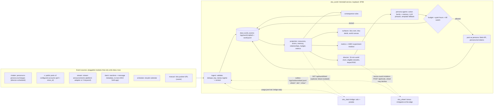

# OKÚ Ecosystem Plan v2: a world-centric living ecosystem (the wheel is a bonus minigame)

Status: v2, written 2026-10-08 on branch `feat/wheel-of-fortune`. **Update 2026-10-09: P-001 is DONE on branch `feat/oku-world`** (git worktree `C:\code\oku-slack-world`, pushed, not merged, not deployed; §3.1), plus a **standalone scheduled porada** that is independent of the wheel (§3.2). Ops reference: `docs/WORLD.md`.
Supersedes v1 (commit `a207d6b`), which built the living world *around* the wheel. v1's full audit (25-mechanic table, bugs B1-B13, POST SCARCITY concept map) is still accurate for the wheel and stays in history: `git show a207d6b:docs/ECOSYSTEM-PLAN.md`.
New direction from Kore (call 2026-10-08): **"The wheel must not be the center of everything; it's only a bonus minigame."** Further wishes from the call: autonomous bot-to-bot interaction between the OKÚ characters without human input; real-life triggers as diary-writing modules (a new Babiš X video gets reposted with a comment, a Macinka/Xavera stream announcement); and the whole ecosystem doubling as an experiment for future POST SCARCITY events.
This document only plans the work. No code has been refactored yet. Effort numbers are estimates (UNVERIFIED). Anything not verified is marked **UNKNOWN**.

---

## 0. TL;DR

- **The world core is a new small Heimdall service, `oku_world`** (loopback `127.0.0.1:8798`, `.venv`, `python -m oku_slack.world.service`). The code stays in this repo under `oku_slack/world/`. It owns the **diary** (`logs/world.sqlite3` + `logs/world.jsonl`), the **state projection**, the **director**, the **persona agents with memory**, **budgets and quiet hours**, the **metrics**, and the **A/B/C economy experiment**.
- **Everything that happens enters through pluggable event sources** that only write diary rows: autonomous persona-to-persona `chatter`, real-life `x` posts and `stream` announcements, Slack activity (`slack`, metadata only), scheduled storylets (`schedule`), a manual `/oku podnet`, persona replies from the bridge (`bridge`), and the **wheel as one optional source**.
- **The wheel is at the edge.** It writes `wheel.*` / `bet.*` / `show.*` rows through a small outbox adapter and can *receive* an occasional bonus-round invitation from the director, which it is free to decline. It never drives the world. v1's "director tilts the wheel weights" idea is dropped.
- **World commands move from `/kolo svet` to `/oku`** (`/oku svet`, `/oku denik`, `/oku proc`, `/oku ticho`, `/oku rezim`, later `/oku slib`, `/oku podnet`). These run on a dedicated "OKÚ Svět" Slack app, because Socket Mode would split events with the persona bridge.
- **Autonomy is bounded by construction.** The director schedules every bot-to-bot exchange (the bridge loop guard stays untouched), and every autonomous post, real-life repost included, passes the same budget, quiet hours and kill switch.
- **The 7 existing commits are kept.** The wheel fixes stay as they are. World v0 (`b38a8a8`, `f537b81`) moves out of the wheel process. Nothing was deployed, so there is no data migration: on first start, `oku_world` backfills from `wheel.sqlite3` read-only.
- **8 small phases, P-001…P-008, about 8.5–11 dev-days**, plus at least 3 weeks of runtime for regimes A/B/C. The first autonomous Slack post arrives in P-004 (real-life triggers).

---

## 1. Architecture

### 1.1 Runtime decision: a new Heimdall service `oku_world` (chosen)

| | Inside `oku_slack` (persona bridge) | New service `oku_world` (**chosen**) |
|---|---|---|
| Fault isolation | A director, poller or LLM bug shares a process with the live persona replies (threads, daily restart at 05:25, process-liveness health only) | Separate process. Stopping it silences the world while replies and the wheel keep working. It doubles as a kill switch |
| Slack | Already holds the persona Socket Mode clients | Uses the persona bot tokens for **Web API posting only** (the proven `wheel/personas.py` pattern). Its own "OKÚ Svět" app handles `/oku` and activity events |
| Diary writes | The bridge would still need a new HTTP endpoint for the wheel | One writer. The wheel and bridge feed it through append-only outbox files |
| Health/ops | `health_type = "process"` | `health_type = "http"` on `/healthz`, its own restart policy, `autostart = false` until P-004 |
| Cost | No new service | +1 Heimdall manifest, +1 port (8798, free in `services.d`), +1 Slack app, roughly +0.5 day |
| POST SCARCITY portability | Entangled with bridge code | A standalone core with source plugins, which is the shape PS can reuse |

Rationale in one line: the world is an experiment that will run (and fail) autonomously for weeks, so it must not be able to take the persona replies or the wheel down with it, and it must be switch-off-able on its own.

Hard constraint behind the Slack split: when one Slack app has several Socket Mode connections, Slack spreads events across them. `oku_world` therefore **must not** open Socket Mode with the persona apps' app tokens, because the bridge would lose events. This is the same reason the wheel already has its own "OKÚ Kolo" app (`oku_wheel.toml` comment).

### 1.2 Diagram (the wheel at the edge)



### 1.3 Components of the world core (`oku_slack/world/`)

| Module | Responsibility | Origin |
|---|---|---|
| `log.py` | Append-only `world_events` (SQLite + JSONL mirror). `record()` never raises. New column `dedupe_key` (unique, nullable) | from `b38a8a8`; storage moves from `wheel.sqlite3` to `logs/world.sqlite3` |
| `ingest.py` | Tails source outboxes (`logs/outbox/*.jsonl`, byte offset kept in kv), plus `POST /api/events` for in-process sources. Validates the envelope and dedupes | new |
| `state.py` + `folds/` | Pure, rebuildable projection. `folds/core.py` covers resources, actors, memory, relationships and budget. `folds/wheel.py` is the existing wheel-specific fold (spun/live/missed/blame) moved almost verbatim | from `b38a8a8` |
| `consequences.py` + `consequences.toml` | Rules that turn any source's events into `consequence.delta` rows | new (v1 §3.5, generalised) |
| `director.py` + `storylets.toml` | 15-min world clock. Storylets with `requires/boosts/blocks`, scored and picked with a keyed RNG (`DIRECTOR:<iso-slot>`). Every fire or skip is logged with its reasons | new |
| `agents.py` | Persona agents: action families (`repost_comment`, `announce`, `chatter`, `blame`, `demand_numbers`, `offer_deal`, `react_emoji`, `bonus_invite`), memory selection, LLM phrasing via `core.generate`, template fallback, `usage` accounting `kind="world"` | new; reuses `scenes.SceneRunner.line` pattern |
| `budget.py` | Daily and per-channel post caps, quiet hours (Europe/Prague), "never during a live wheel event", owner kill switch. The budget is a **projection** over `agent.posted` rows, so it needs no separate counter | new |
| `poster.py` | Persona posting through the Web API (mentions stripped, bot messages so the bridge ignores them) | `wheel/personas.py` moved to a shared module |
| `sources/*.py` | `chatter`, `x`, `stream`, `slack`, `schedule`, `manual`, `bridge_usage`, `wheel` (outbox reader) | new |
| `view.py` | Czech texts for `/oku svet` and the world canvas | from `f537b81` |
| `metrics.py`, `scripts/world_report.py` | Hypotheses, health metrics, causal chains | new |
| `service.py` | aiohttp on loopback: `/healthz`, `/api/world`, `/api/world/brief`, `/api/events`. Every route except `/healthz` rejects proxied requests (`loopback_only` from `wheel/server.py`). Owns the OKÚ Svět Socket Mode app | new |

Source plugin contract (small on purpose):

```python
class Source:
    name: str                                   # "x", "stream", "slack", "wheel", ...
    def poll(self, now) -> list[dict]: ...      # optional: drafts {type, actor, subject, payload, dedupe_key}
    def on_event(self, raw) -> list[dict]: ...  # optional: push-style (Slack events, outbox lines)
# Sources never post to Slack and never mutate state. They only return diary drafts.
```

Config lives in a new `world.toml` (no secrets; tokens come from user env vars as today):

```toml
[world]
regime = "A_scarce"
quiet_hours = ["22:00", "08:00"]          # Europe/Prague
[budget]
autonomous_posts_per_day = 6              # top-level posts, all sources together
per_channel_min_gap_h = 3
chatter_exchanges_per_day = 2             # each exchange <= 4 turns in one thread
llm_calls_per_day = 40
[personas.marty]
home = "C0C76ATANTX"                      # #oku-socky
reacts_to = ["x.post_seen:video", "slack.reaction:spike"]
[personas.peta]
home = "C0C75CZPRUK"                      # #oku-disko; also speaks for Macinka (alias)
reacts_to = ["stream.announced"]
[sources.x]
enabled = false
accounts = [{ handle = "AndrejBabis", kinds = ["video"], reposters = ["marty", "babis"] }]
poll_min = 10
active_hours = ["08:00", "22:00"]
[sources.stream]
enabled = false
channels = []                             # Macinka / Xavera: platform + handle UNKNOWN (Kore to name)
```

### 1.4 Event sources

| Source | What it writes | Trigger | Notes |
|---|---|---|---|
| `chatter` (autonomous) | `chatter.started`, `chatter.turn`, `chatter.ended` | Director storylet (e.g. `KALOUSEK_VINA`, `BABIS_CHCE_CISLA`) | 2–3 personas, ≤ 4 turns in one thread in the opener's home channel. Each turn is generated from the thread transcript plus memories (the `meeting.py` turn pattern) and posted with that persona's token. **Bot-to-bot without a Slack loop:** the bridge keeps ignoring bot messages (`bridge.ignored()`, `bridge.py:19-21`), so no persona ever "answers" another through Slack events; only the director schedules turns. Humans can still mention a persona in the thread and the bridge answers as today |
| `x` (real life) | `x.post_seen`, then `director.fired` → `agent.posted` (repost with comment) | Poll of a configured public account | See §4 for feasibility and cost. "Repost" means posting the x.com link plus a persona comment **into an OKÚ Slack channel**; nothing is ever posted to X |
| `stream` (real life) | `stream.announced`, `stream.live`, `stream.ended` | Platform adapter or X keyword filter | Peťa (who speaks for Macinka) posts once per stream in #oku-disko; dedupe by stream id |
| `slack` (activity) | `slack.reaction`, `slack.message_meta` | OKÚ Svět app events in OKÚ channels | Metadata only: user, channel, ts, thread or not, personas mentioned, has_link, length bucket. **Never text** |
| `schedule` | `schedule.due` | `storylets.toml` calendar (e.g. Monday-morning "porada" hint, Friday kantýna) | Still goes through director eligibility and budget |
| `manual` | `manual.podnet` | `/oku podnet <url> [persona]` (owner) | A zero-cost real-life trigger when there is no API |
| `bridge` | `bridge.reply` (kind solo/meeting, persona, channel) | Read-only tail of the existing `logs/usage.jsonl` | Zero changes to the bridge. Lets memory know "Babiš talked to ICIK in #čapák" |
| `wheel` (optional minigame) | `wheel.spin/confirm/live/done/expired/vetoed`, `bet.*`, `show.*`, `command.used`, `ui.kolo` | The wheel's own engine | Written through the outbox adapter (§2.2). Optional: the world runs the same with `oku_wheel` stopped |
| internal | `director.fired/skipped`, `agent.posted`, `budget.denied`, `consequence.delta`, `source.degraded` | The core itself | Every autonomous decision is explainable from the diary (`/oku proc <we_id>`) |

### 1.5 Diary envelope (v2)

Same as v1/`b38a8a8` (`id, seq, ts, type, source, actor, subject, payload, causal_parents, regime, content_version, run_id`), with three changes:
- new `dedupe_key` (unique, nullable), for at-least-once outbox ingestion and external ids (`x:<post_id>`, `wheel:<uuid>`);
- `source` names the module (`wheel`, `x`, `stream`, `slack`, `schedule`, `manual`, `bridge`, `director`, `agent`, `consequence`, `backfill`). The wheel's former `engine`/`slack`/`room` tags move into `payload.via`;
- `subject` is namespaced by source (`wheel:event:<id>`, `x:post:<id>`, `chatter:<id>`, `agent:<we_id>`).

Privacy rule (unchanged): Slack human free text is never copied into the diary, and room chat stays in the wheel's `chat` table. Public X post text is stored only as a ≤ 280-char excerpt, needed to reproduce and explain the persona comment.

### 1.6 Sample diary rows (illustrative: `we_*` ids, post ids, uuids and texts are made up; `ts` values are 2026-10-08 Prague time)

`logs/world.jsonl`, from five different sources (`x`, `director`, `agent`, `slack`, `wheel`):

```json
{"id":"we_0212","seq":212,"ts":1791447151.0,"type":"x.post_seen","source":"x","actor":"ext:x:AndrejBabis","subject":"x:post:1975000000000000001","dedupe_key":"x:1975000000000000001","payload":{"account":"AndrejBabis","url":"https://x.com/AndrejBabis/status/1975000000000000001","created_at":"2026-10-08T08:05:12Z","media":"video","duration_s":94,"lang":"cs","text_excerpt":"Čau lidi, …"},"causal_parents":[],"regime":"A_scarce","content_version":"<sha>","run_id":"oku-world-1"}
{"id":"we_0213","seq":213,"ts":1791447153.0,"type":"director.fired","source":"director","actor":"marty","subject":"x:post:1975000000000000001","dedupe_key":null,"payload":{"storylet":"REPOST_VIDEO","why":["x.post_seen media=video","marty in reposters","budget 2/6 today","not quiet hours","#oku-socky last post 07:58 (>3 h gap)"],"rng_key":"DIRECTOR:2026-10-08T10:00"},"causal_parents":["we_0212"],"regime":"A_scarce","content_version":"<sha>","run_id":"oku-world-1"}
{"id":"we_0214","seq":214,"ts":1791447160.4,"type":"agent.posted","source":"agent","actor":"marty","subject":"x:post:1975000000000000001","dedupe_key":null,"payload":{"family":"repost_comment","channel":"C0C76ATANTX","ts":"1791447160.000100","llm":true,"fallback":false,"chars":121,"memory_refs":[],"budget":{"day_used":3,"day_max":6}},"causal_parents":["we_0213"],"regime":"A_scarce","content_version":"<sha>","run_id":"oku-world-1"}
{"id":"we_0219","seq":219,"ts":1791448269.0,"type":"slack.reaction","source":"slack","actor":"icik","subject":"agent:we_0214","dedupe_key":"slack:rx:C0C76ATANTX:1791447160.000100:icik:joy:+","payload":{"emoji":"joy","added":true,"channel":"C0C76ATANTX"},"causal_parents":["we_0214"],"regime":"A_scarce","content_version":"<sha>","run_id":"oku-world-1"}
{"id":"we_0231","seq":231,"ts":1791470412.0,"type":"wheel.done","source":"wheel","actor":null,"subject":"wheel:event:cd3df3f9","dedupe_key":"wheel:6b1e0c2a-1d3e-4f7a-9a51-2f4c8d0e7b11","payload":{"via":"engine","key":"kantyna","host":"alenka","confirmed":["icik"],"invited_by":"we_0228"},"causal_parents":["we_0228"],"regime":"A_scarce","content_version":"<sha>","run_id":"oku-world-1"}
```

The Slack post behind `we_0214` (Marty bot, #oku-socky, illustrative):
`Nové video od šéfa 🎥 https://x.com/AndrejBabis/status/1975000000000000001 Tohle musíme vytěžit, kdo nedá lajk, jde do kantýny.`

An autonomous chatter turn, for scale (#oku-vina thread, illustrative):
`{"type":"chatter.turn","source":"agent","actor":"kalousek","subject":"chatter:7f3a","payload":{"turn":2,"of":3,"reply_to":"babis","family":"blame","memory_refs":["we_0057"]}}` → "Já za nic nemůžu. Na tu poradu nepřišel Kore, mám to v zápisu."

### 1.7 Persona agents, memory, budget, quiet hours

- **Cast:** Babiš, Alenka, Bourák, Marty, Peťa (who also speaks for Macinka, `ALIAS`) and Kalousek speak through their own bot tokens. **Monika stays the wheel's host.** She speaks only inside the wheel, and that includes the bonus-round invitation, which the wheel itself posts.
- **Memory** is a projection: per persona, the ≤ 20 newest diary rows the persona "witnessed". That means rows in their home channel, chatter they took part in, wheel events they hosted, real-life posts they reacted to, and bridge replies they gave. Memory is summarised deterministically by templates, not the LLM. Relationships are typed edges with evidence (`grudge`, `rivalry`, `owes`), never one trust number.
- **The LLM speaks; code decides.** The director picks the storylet, persona and action family. The LLM only phrases it, with a hard token cap, and templates are the fallback. LLM text never mutates state.
- **Budget (default, decision D2):** ≤ 6 autonomous top-level posts/day in total; ≤ 1 per channel per 3 h; ≤ 2 chatter exchanges/day of ≤ 4 turns each; ≤ 40 world LLM calls/day; nothing during quiet hours (22:00–08:00 Prague) or while a wheel event is `live`. A denied post becomes a `budget.denied` row. Real-life reactions have a freshness TTL of 6 h and are dropped after that, never queued forever.
- **Kill switches:** `/oku ticho [h]` (owner) silences agents and keeps sources recording. Stopping the `oku_world` service silences everything with no effect on replies or the wheel.

### 1.8 Metrics and the A/B/C economy experiment

The regimes are now **world-level**. Korun remain the wheel's scoring, and the wheel reads the current regime from `GET /api/world` (cached; falls back to its own config if the world is down). Each regime runs ≥ 7 days, A → B → C by default (carried over from v1).
- **A_scarce:** finite Dotace pool; korun scarce, as today.
- **B_abundant:** pools and korun refill every morning.
- **C_no_currency:** no spendable numbers are shown. Humans act through reactions/emoji choices on persona posts, commitments (`/oku slib`), and stake-free wheel rounds. Reputation is witnessed acts per persona audience (POST SCARCITY PS-R1/PS-R3).

| ID | Hypothesis | Metric (from the diary) | Support threshold (proposal) |
|---|---|---|---|
| H1 | Real-life triggers draw more human response than synthetic chatter | human reactions/replies within 2 h per `agent.posted`, by source | ≥ 1.5× |
| H2 | Memory callbacks make the cast feel coherent | positive-reaction share on posts with `memory_refs` vs without | ≥ 60% |
| H3 | Autonomy stays welcome inside the budget | negative signals (🔇, "stop", `/oku ticho`) per week | ≤ 1 / week |
| H4 | Abundance (B) kills betting but not participation | bets/day A→B; non-material actions/day A→B | bets −50%, non-material ≥ 80% of A |
| H5 | Without currency (C), commitments and relationships keep people engaged | active human-days, commitments made/kept | C ≥ 70% of A |
| H6 | The wheel works as an occasional bonus, not a chore | invitations accepted; live rate of accepted rounds (quorum 1) | ≥ 50% live |

Always-on health metrics: autonomous posts per persona/channel vs budget; `budget.denied`; LLM calls, latency and template-fallback rate (`usage.jsonl`); source errors and `source.degraded`; X read cost estimate (posts read × $0.005); director eligible vs fired; Slack error codes per hour.

---

## 2. The wheel at the edge

### 2.1 What the wheel may and may not do

- It **may** emit diary rows (spins, confirmations, outcomes, bets, show, commands), read the regime, and accept or decline a bonus-round invitation.
- It **may not** be required by the world (the world runs without `oku_wheel`), hold world state, render world state, or have its odds changed by the world. Odds stay the wheel's own config, so `economy.odds` stays honest without the v1 tilt logic.
- **Bonus-round invitation:** the director may fire a `BONUS_ROUND` storylet at most once a day, outside quiet hours, only when no wheel event is active and the budget allows. It sends a loopback `POST 127.0.0.1:8797/api/invite {reason, suggested_key, expires_at, we_id}` (a new loopback-only route on the wheel). The wheel decides: it shows a Monika line and a Točit button in its panel, or answers `declined` (busy, round open, cooldown). The outcome returns as normal `wheel.*` rows with `payload.invited_by`. `suggested_key` is only a hint shown in the text, never a weight change.

### 2.2 Wheel → world adapter

`oku_slack/wheel/world_client.py` replaces the direct `WorldLog` in `Engine.__init__`. It keeps the same `record(type, actor, subject, payload)` signature, so every hook call site from `b38a8a8` stays. Each row is appended to `logs/outbox/wheel.jsonl` with a uuid `dedupe_key`, and the call never blocks or raises. `oku_world` tails that file. If the world is down, nothing is lost, and the wheel doesn't care. This evolves the existing `logs/world.jsonl` mirror rather than adding a network dependency to the 0.5 s tick.

### 2.3 What happens to the 7 local commits

| Commit | Content | Verdict |
|---|---|---|
| `297d17b` | `confirm_quorum` (default 1, D1), join while ready, B5 `double_bet` fix | **Stays as is** (wheel fix) |
| `a218401` | Panel exponential backoff, `response_metadata` logging, text-only degrade, card only when ready (B2/B3) | **Stays as is** |
| `70196f5` | `allow_force = false` + hidden "Vynutit legendu" (D10); Čapák follow-up disabled (D12) | **Stays as is** |
| `50c1599` | Deploy defaults to the named tunnel, `-Test` runs the full suite, README/WHEEL sweep | **Stays.** The "world layer" paragraph in `docs/WHEEL.md` is rewritten in P-001 to point at `docs/WORLD.md` |
| `a207d6b` | v1 plan | **Replaced** by this document (still in history) |
| `b38a8a8` | `oku_slack/world/{log,state,view}.py`, engine hooks, backfill, `/api/world` on the wheel server | **Moves.** The modules stay in `oku_slack/world/` but run in `oku_world`. Diary storage moves to `logs/world.sqlite3` with `dedupe_key`. Engine hooks stay but write through `world_client.py`. `backfill()` stays and becomes `oku_world`'s one-time import from `wheel.sqlite3` (opened read-only). `/api/world` moves to `oku_world:8798` (the `loopback_only` guard is reused) and is removed from `:8797`. The wheel-specific branches of `state.apply` become `folds/wheel.py`. `tests/test_world.py` is split into core and wheel-fold tests |
| `f537b81` | `/kolo svet`, panel world line + overflow "Stav světa", canvas section "Stav světa", vetoed labels | **Changes.** `/kolo svet` becomes **`/oku svet`**. For one release, `/kolo svet` answers ephemerally "Stav světa je teď /oku svet". The panel world line and canvas section leave the wheel, which keeps only a static pointer `🌍 /oku svet`. A world-owned canvas "OKÚ · Stav světa" takes over. `view.py` texts are reused. The vetoed labels stay |

Because none of this was deployed, production `wheel.sqlite3` has no `world_events` table, so nothing needs migrating.

### 2.4 World command name

Proposal: **`/oku`** on a dedicated **"OKÚ Svět"** Slack app (Socket Mode token for `oku_world`; scopes `commands`, `reactions:read`, `channels:history`/`groups:history` for metadata, `canvases:write`; it posts no persona lines). Czech subcommands with ASCII aliases:

| Command | Who | Phase |
|---|---|---|
| `/oku svet` (`svět`) | anyone, ephemeral | P-002 |
| `/oku denik [n]` | anyone, ephemeral; last n rows as one-liners, no payloads | P-002 |
| `/oku proc <we_id>` | anyone, ephemeral; causal chain + director reasons | P-002 |
| `/oku ticho [h]` / `/oku nahlas` | owner | P-003 |
| `/oku podnet <url> [persona]` | owner | P-004 |
| `/oku rezim A\|B\|C` | owner | P-007 |
| `/oku slib <text>` | players | P-007 |

Sample `/oku svet` (P-002, illustrative values):
```
🌍 *Stav světa OKÚ* · režim A (vzácné koruny) · 08.10. 11:00
💶 Dotace 5 000 · 📣 Kampaň 35/100 · 🍟 Hranolky 80 · 👍 Lajky 1 200
🫵 Vina: Kalousek 4 · Kore 2 · ICIK 1
🗣️ Dnes: 3/6 autonomních příspěvků · 1 debata (Babiš × Kalousek) · 1 repost (Marty)
📡 Zdroje: X ✅ · stream ⏸ · kolo ✅ (7× točeno, 0× živě)
🧾 Postavy si o tobě pamatují: Babiš: propásl(a) jsi Mimořádnou poradu (7.10.)
```

---

## 3. Phases (small, each ends with tests green, a doc update and Kore's go/no-go)

Effort is in focused dev-days with agent assistance (estimate, UNVERIFIED).

| Phase | Scope | Effort | Slack posts added |
|---|---|---|---|
| **P-000** (done, local) | The 7 commits: wheel fixes + world v0 inside the wheel | — | none |
| **P-001** ✅ DONE 2026-10-09 (`feat/oku-world`, §3.1) World core carve-out | `service.py` (loopback :8798, `/healthz`, `/api/world`); `logs/world.sqlite3` + `dedupe_key`; `ingest.py` outbox tailing; `wheel/world_client.py`; engine hooks rewired; `/api/world` removed from the wheel; backfill from `wheel.sqlite3` read-only; `folds/wheel.py`; draft Heimdall manifest `oku_world.toml` (`autostart = false`; added to `services.d` only with Kore's OK); `docs/WORLD.md`. **Exit:** all wheel tests pass with `oku_world` stopped; diary rows arrive with `source=wheel`; a rebuild-from-scratch test passes | 1–1.5 d | none |
| **P-002** `/oku` + Slack activity + world surfaces | OKÚ Svět app manifest (Kore creates and installs it); `/oku svet\|denik\|proc`; `slack` source (reactions, message metadata, no text); `bridge` source (tail `usage.jsonl`); world canvas; `/kolo svet` pointer; panel/canvas world sections removed from the wheel. **Exit:** a test asserts no text field ever reaches the diary | 1 d | none (ephemeral only) |
| **P-003** Persona agents, memory, budget | `agents.py`, `poster.py` (moved from `wheel/personas.py`, re-exported for the wheel), memory + relationship folds, `budget.py`, quiet hours, `/oku ticho`; optional `/api/world/brief` used by the bridge (failure → reply as today). Agents run in **dry-run** (they write `agent.dry_run` rows, post nothing). **Exit:** a 7-day fake-clock test never exceeds the budget | 1.5 d | none (dry-run) |
| **P-004** Real-life triggers | `sources/x.py`, `sources/stream.py`, `sources/manual.py` + `/oku podnet`; fixed reaction rules `REPOST_VIDEO`, `STREAM_ANNOUNCE`; recorded-fixture tests (no live API in tests); `source.degraded` on 402/403/429. **Exit:** one real Babiš video reposted by Marty within 15 min, inside budget | 1–1.5 d | **yes**, ≤ 2/day from this source |
| **P-005** Director + autonomous chatter + schedule | `director.py`, `storylets.toml` (starter: `KALOUSEK_VINA`, `BABIS_CHCE_CISLA`, `HRANOLKY_DOCHAZEJI`, `MARTY_VIRAL`, `ABSENCE_48H`), `chatter` source (2–3 personas, ≤ 4 turns, one thread), `schedule` source; P-004 rules become storylets. 2 days of dry-run, then live. **Exit:** every fire is explainable via `/oku proc`; no bot-to-bot loop (the bridge loop guard is unchanged; tested) | 1.5–2 d | **yes**, within the shared budget |
| **P-006** Consequences + wheel bonus round | `consequences.toml` across all sources (e.g. a video repost → `lajky +`, chatter blame → `blame +1`, `wheel.done kantyna` → `hranolky +60`, `wheel.expired` → failure without game over); wheel `POST /api/invite` (loopback-only) + `BONUS_ROUND` storylet (≤ 1/day). **Exit:** the world runs a week of tests with the wheel off; invitations can be declined | 1 d | Monika invitation (wheel panel), ≤ 1/day |
| **P-007** Commitments + economy regimes | `/oku slib`, `/oku rezim`, regime-aware surfaces; the wheel reads the regime; emoji choices on persona posts → `choice.*`. **Exit:** A/B/C end to end in tests; C shows no spendable score | 1–1.5 d | none new |
| **P-008** Readout + POST SCARCITY export | `scripts/world_report.py` (H1–H6, cost, causal chains, per-source response), "Lessons for PS" | 0.5–1 d | none |

### 3.1 P-001 as delivered (2026-10-09, branch `feat/oku-world`)
- `oku_slack/world/service.py`: `python -m oku_slack.world.service` on **127.0.0.1:8798**. Every route (including `/healthz`) refuses peers other than `127.0.0.1` and any request with proxy/tunnel headers. Routes: `/healthz`, `/api/world`, `/api/budget`, `POST /api/events`. It uses the stdlib `http.server` instead of aiohttp, so it runs in `.venv` or `.venv-wheel`.
- Diary `logs/world.sqlite3` + `logs/world.jsonl` (`log.Diary`): unique nullable `dedupe_key`, ingest validation (type/source/size/ts, free-text payload keys rejected), causal parents, never raises.
- Sources (`ingest.py`):
  - the wheel outbox `logs/outbox/wheel.jsonl`;
  - the `usage.jsonl` tail -> `bridge.reply` (pulled forward from P-002);
  - a read-only tail of the old in-wheel `world_events` until the outbox wheel is deployed.
- One-time backfill (`backfill.py`) from `wheel.sqlite3`, opened read-only.
- Read-only projection (`state.py`): resources, blame, actors, persona memory (≤ 20), bridge, porada, sources, metrics. The wheel fold stays in `state.py`; there is no separate `folds/` package yet.
- `budget.py` (pulled forward from P-003): D2 defaults, quiet hours 22–08 Prague (with a built-in DST rule because the Windows venvs have no tzdata), "not while a wheel event is live", and a kill switch (config / `logs/world.kill` / env / kv). `dry_run = true` by default.
- Wheel at the edge:
  - `wheel/world_client.py` replaces `WorldLog` in the engine, with the same call sites;
  - the panel world line and the canvas "Stav světa" section are removed (pulled forward from P-002);
  - `/api/world` is removed from `:8797`;
  - `/kolo svet` fetches the snapshot from `oku_world` with a fallback text, instead of the planned static pointer, because `/oku` only arrives in P-002.
- Config lives under `[world]` in `config.toml` (not a separate `world.toml`) and is re-read on change.
- Heimdall manifest `services.d/oku_world.toml`: `enabled = true`, `autostart = false`, `cwd` = the worktree for now, `OKU_WORLD_SOURCE_LOGS` = the live `logs`.
- Not done in P-001: the `/oku` app, the director, persona agents/poster, consequences, and the `POST /api/invite` bonus round (all unchanged in later phases).

### 3.2 Standalone scheduled porada (new; independent of the wheel)
The world's storylet calendar (`scheduler.py`) starts a **real bot porada** (`meeting.py`) in #oku-porada every weekday at 10:00 Prague (`porada_schedule = "mon-fri 10:00"`). It reuses the file hand-off the bridge already watches (`logs/outbox/meeting_start.jsonl` -> `meeting_ack.jsonl`, `efde370`/`1a9b73d`).
- The world writes a request with `source = "world"`, no `thread_ts`, a topic generated from world state (or a template), and an opener.
- The bridge (`Coordinator.start_external`) has the chair Babiš post the opener top-level, runs the porada in its thread, and acks with `thread_ts`.
- Every step is a diary row: `schedule.due` (once per slot, restart-safe) -> `budget.denied` | `porada.dry_run` | `porada.requested` -> `porada.started` | `porada.failed`.
- The request respects the budget (it counts as 1 top-level post + 12 LLM calls), the per-channel gap, quiet hours, "no wheel event live" and the kill switch.
- In `dry_run` (the default) it only writes `porada.dry_run` and **no hand-off line**.
- A bridge older than this change answers `rejected`, so a premature live request is harmless. A late slot (service down > 30 min) is skipped, never caught up.

Total: about **8.5–11 dev-days**, plus ≥ 3 weeks of wall-clock time for regimes A/B/C (which can start after P-005).
Dependencies: P-001 → P-002 → P-003 → {P-004, P-005} → P-006 → P-007 → P-008. P-004 and P-005 are independent, so if Kore wants bot-to-bot chatter before real-life triggers, swap them.

---

## 4. Real-life triggers: feasibility (described only; no API was called while writing this)

### 4.1 X posts of a configured public account (e.g. Babiš)

- **Access:** the official X API v2 with an app-only Bearer token. According to X's developer docs (checked 2026-10-08), the API is pay-per-use with prepaid credits and has no free read tier: Basic/Pro closed to new sign-ups when pay-per-use launched in Feb 2026. The token would be a user env var (`OKU_X_BEARER_TOKEN`, passed by Heimdall), never in the repo or logs.
- **Cheap polling:**
  1. Resolve the handle to an id once: `GET /2/users/by/username/AndrejBabis` ($0.010, cached forever).
  2. Poll `GET /2/users/:id/tweets?since_id=<last_seen>&max_results=5&exclude=retweets,replies&tweet.fields=created_at,lang,attachments&expansions=attachments.media_keys&media.fields=type,duration_ms`.
  3. Keep `since_id` in kv, filter `media.type == "video"`, and dedupe by `x:<post_id>`.
  4. Poll every 10 min, only 08:00–22:00 Prague, which is about 84 requests/day.
- **Cost:** billing is per returned resource: $0.005 per post read, with re-reads of the same post deduplicated within a UTC day. With `since_id`, an empty poll returns no posts. That such a poll costs $0 is expected but **UNVERIFIED**; check the Developer Console usage view in week 1. Whether media expansions are billed separately is also **UNKNOWN**. At roughly 5–15 posts/day the estimate is ≤ $0.08/day, about **$1–2.5/month**. Set a Developer Console spending limit (default $5/month); hitting it blocks requests and is handled as `source.degraded`.
- **Rate limits:** `GET /2/users/:id/tweets` allows 10,000 requests/15 min per app (900 per user context). 84/day is negligible. The source still honours `x-rate-limit-remaining/reset`, backs off until reset on 429, and disables itself for the day on 402/403 (credits or spending limit).
- **Latency:** worst case about 10 min plus the director tick. To repost faster, the `x` source may call the director immediately; the budget still applies.
- **Not recommended:** scraping x.com, Nitter mirrors, or unofficial embed/syndication endpoints (fragile, against ToS). **Free complements:** if the same videos also land on a YouTube channel, its RSS feed (`https://www.youtube.com/feeds/videos.xml?channel_id=…`, no key) costs $0; whether that holds for this account is **UNKNOWN**. `/oku podnet <url>` always works at $0.
- **Posting to Slack respects the budget:** the repost is a normal `agent.posted` subject to quiet hours, per-channel gap, the daily cap and the kill switch. If denied, a `budget.denied` row is written and the reaction may retry within its 6 h TTL, otherwise it is dropped. Several new videos inside one window are batched into one post, at most 1 repost per account per 3 h. Nothing is ever posted **to** X: writes cost $0.015, or $0.20 with a URL, and are public.
- **Untrusted input:** post text is data. It is wrapped as a quotation in the prompt, mentions are stripped (`personas.safe`), and links are never followed. The comment reacts only to the public post (see D4).

### 4.2 Stream announcements (Macinka / Xavera)

- The exact accounts and platforms are **UNKNOWN**: the call note spells "Macenko / Xavera". The `stream` source therefore takes per-channel adapters from config:
  - **Twitch:** Helix `GET /helix/streams?user_login=…` with a free app access token, polled every 5 min in active hours, for `stream.live`/`stream.ended`. EventSub is skipped because it needs a public webhook or a user-token WebSocket.
  - **YouTube:** channel RSS (free) for new and upcoming items. Optionally Data API `videos.list` with `liveStreamingDetails` (1 quota unit per call against the default daily quota) for `stream.announced` with a scheduled start.
  - **X keyword:** the same `x` source on the streamer's account, filtered for "stream / živě / live / dnes ve", for `stream.announced`. Costs as in §4.1.
  - **Kick:** API availability **UNKNOWN**; use `/oku podnet` meanwhile.
- Peťa (who speaks for Macinka) posts once per stream in #oku-disko, deduped by stream or post id, inside the budget.

---

## 5. Principles carried over from v1 and POST SCARCITY

- Append-only truth with rebuildable projections. Causal events: randomness only picks among eligible storylets, through keyed and recorded draws. Failure without game over. Reputation is witnessed acts, never spendable credit (PS-R3). Debuggability through `/oku proc` (the PS "god view").
- Tensions, stated honestly: korun, bets and cooldowns (forbidden in PS) exist only inside the wheel minigame and serve as the Regime A baseline. OKÚ uses Gemini (cloud) while PS requires local inference (PS-R11), so LLM findings don't transfer one-to-one. A local Nautilus/Bonsai/Ollama path stays a later option (v1 D5).
- Resolved since v1: D1 quorum 1 (`297d17b`); D10 force off (`70196f5`); D12 Čapák follow-up off + loopback-only world routes (`70196f5`, `b38a8a8`); D2 superseded by §1.1 (`oku_world`). Carried over with v1 defaults: D4 regimes A → B → C at 7 days each; D7 resources Dotace/Kampaň/Hranolky/Lajky + Vina; D11 thresholds as in §1.8.

## 6. Open decisions for Kore (max 5, recommended default first)

| ID | Decision | Recommended default | Alternatives |
|---|---|---|---|
| D1 | Slack surface for the world | A dedicated **"OKÚ Svět"** app owning **`/oku`** (svet, denik, proc, ticho, podnet, rezim, slib); `/kolo svet` points there for one release | `/oku` registered on the Babiš app and forwarded to `oku_world` (no new app, but couples the bridge); another name such as `/svet` |
| D2 | Autonomy budget | ≤ 6 autonomous top-level posts/day total; ≤ 1 per channel per 3 h; ≤ 2 chatter exchanges/day of ≤ 4 turns; ≤ 40 world LLM calls/day; quiet hours 22:00–08:00 Prague; none while a wheel event is live; 2 days of dry-run before going live | stricter (≤ 3/day, persona channels only) · looser |
| D3 | Real-life data access | Pay-per-use X API, `@AndrejBabis` only, videos only, poll 10 min 08–22, Console spending limit **$5/month**; plus `/oku podnet`; Macinka/Xavera via the platform Kore names | free-only (manual `/oku podnet` + YouTube RSS where it exists) · more X accounts (≈ $0.15–0.5/month each at low volume, UNVERIFIED) |
| D4 | Satire and consent guardrails for real-life content | Comments react only to the public post itself: link + ≤ 2 sentences; no invented quotes or factual claims about real people; no health, family or criminal topics; posts only in OKÚ channels, never on X; Kore's 🗑 reaction makes the world delete its own post; ICIK is told that metadata (not text) is logged | allow topical riffing beyond the post · no real-life triggers for real politicians (streams only) |
| D5 | Branch and sequencing (**superseded 2026-10-09**: P-001 went to `feat/oku-world` in a worktree, because the live services run from the `feat/wheel-of-fortune` working tree; see `docs/WORLD.md` go-live) | Do P-001 as the next commits on `feat/wheel-of-fortune` (no history rewrite), then push and merge PR #2 with the wheel fixes + the world core carved out; P-002+ on `feat/oku-world` | Rebase now to move `b38a8a8`/`f537b81` onto a new branch and merge only the wheel fixes first (rewrites unpushed commits; needs Kore's OK) |

## 7. Risks

- **Noise:** budget, quiet hours, dry-run first, `/oku ticho`, and stopping the service; H3 measures it.
- **Loops:** persona output stays bot messages, `bridge.ignored()` is unchanged, chatter turns come only from the director, and each exchange has a turn cap.
- **Cost:** the X spending limit; the LLM call cap; X read cost reported daily in the readout.
- **Public exposure:** `oku_world` binds loopback only, and every API route rejects proxied requests (the tunnel forwards only `:8797`).
- **Satire sensitivity:** D4 guardrails go in before P-004, real public figures stay parodied only inside OKÚ channels, and the existing persona prompt rules stay.
- **Two writers posting as one bot:** both the wheel (scenes) and `oku_world` post via persona tokens. Both handle Slack `ratelimited` errors, and the world counts wheel scenes (`wheel.live`) as busy time for the budget.
- **Scope creep:** small phases with exit criteria; the first autonomous post only arrives in P-004.

## 8. UNKNOWNs

- Whether an empty `since_id` poll and media expansions are billed (verify in the X Developer Console in week 1).
- Which accounts and platforms "Macinka / Xavera" stream on, and whether Babiš videos also appear on a YouTube channel.
- How Slack unfurls x.com video links in this workspace (not checked).
- Whether port 8798 is free outside the Heimdall manifests (only `services.d` was checked).
- Effort estimates are UNVERIFIED planning numbers.
