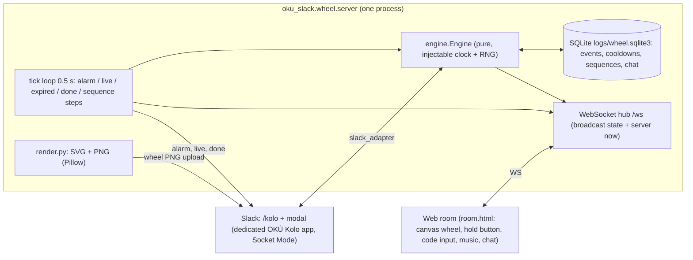

# OKÚ Wheel of Fortune ("kolo") + roomka

One Python service (`oku_slack.wheel.server`, aiohttp) holds all authoritative state; Slack and the web room are thin clients.
Separate from the live persona bridge (`oku_slack.bridge`, Heimdall `oku_slack`): own venv `.venv-wheel`, own process, own Slack app.

## Architecture



| Module | Role |
|---|---|
| `players.toml` | players (Kore, ICIK), timings, wheel events (OKÚ personas as hosts) |
| `oku_slack/wheel/engine.py` | spin, confirmation (code / server-timed hold), 5-min alarm, event state machine, 30-min cooldown, 2-min sequence, chat, snapshot |
| `oku_slack/wheel/store.py` | SQLite persistence (cooldowns survive restarts) |
| `oku_slack/wheel/render.py` | wheel SVG + PNG; same geometry as the room canvas |
| `oku_slack/wheel/server.py` | aiohttp app: `/` room, `/ws`, `/api/state`, `/wheel.png`, tick loop |
| `oku_slack/wheel/slack_adapter.py` | `/kolo` command, code modal, channel notifications |
| `manifests/kolo.yaml` | manifest for the dedicated Slack app (slash command, interactivity) |

## Rules
- **Spin**: weighted random event; the server picks `target_angle` inside the winning segment, `turns`, `spin_at`. One active event at a time.
- **Confirmation**: event goes `pending -> ready` only when ALL players confirmed. Deliberate only: type the 4-char event code (room or Slack modal) or press-and-hold in the room; the hold is measured by the server between `hold_start` and `hold_end` (>= `hold_min_s`, 2 s). Client timing is ignored.
- **Start**: at `start_at` (spin + `lead_s`, 10 min) if ready; if confirmations finish later, it starts on the next tick; not all confirmed by `start_at + confirm_wait_s` -> `expired`.
- **Alarm**: once, `alarm_before_s` (300 s) before `start_at`; Slack message mentions all players.
- **Charged command**: per player, once per `cooldown_s` (1800 s), stored in SQLite; starts a 120 s server-timed sequence (steps at 0/30/60/90/110 s).
- **Room sync**: every WS message carries the full snapshot + server `now`; clients compute `offset = server_now - local_now`. Spin angle is `(turns*360 + target_angle) * easeOutCubic((now - spin_at)/spin_ms)`, so all clients show the same spin. Music starts at offset `now - live_at` (URL via `<audio>.currentTime`, or a built-in synthesized loop when `music_url` is empty).
- **Room auth**: `?p=<player>&k=<room_key>`; without them the client is a read-only spectator and never receives the code.

## Run
```powershell
cd C:\code\oku-slack
.\scripts\run-wheel-room.ps1            # creates .venv-wheel on first run, opens http://127.0.0.1:8787/?p=kore&k=kore-local
.\scripts\run-wheel-room.ps1 -Test      # wheel tests
.\scripts\run-wheel-room.ps1 -Slack     # also connect the OKÚ Kolo app (env SLACK_OKU_WHEEL_BOT_TOKEN / SLACK_OKU_WHEEL_APP_TOKEN)
```
ICIK: `http://<host>:8787/?p=icik&k=icik-local`. Env: `OKU_WHEEL_CONFIG`, `OKU_WHEEL_DB`, `OKU_WHEEL_HOST`, `OKU_WHEEL_PORT`, `OKU_WHEEL_PUBLIC_URL` (link used in Slack messages).

## Slack
`/kolo` spin (ephemeral reply with your code + wheel PNG posted to `slack_channel`), `/kolo potvrdit` (modal with code), `/kolo prikaz`, `/kolo stav`.
Slack cannot animate: it gets the stopped wheel PNG + result text; the animation is in the room.

## Open items
- ICIK Slack id is a placeholder in `players.toml`.
- Room is bound to 127.0.0.1; ICIK needs a public URL (tunnel / hosting) and real `room_key`s.
- Music: only the built-in synthesized cue is shipped; any `music_url` must be licensed.

## Host announcer: Monika Babišová
`oku_slack/wheel/host.toml` holds random line pools (`spin`, `result`, `alarm`, `nag`, `expiry`, `legendary`) with placeholders `{title} {who} {time} {missing}`.
The engine stores the latest line on the event (`host_say`); the room shows it in the host bubble, Slack messages prefix it.
Triggers: spin (or `legendary`), `reveal` after the spin animation (`spin_ms`), alarm (5 min), `nag` once `nag_before_s` before start if someone is missing, expiry.

## Legendary event: Mimořádná schůze sněmovny / Titanic scéna
- `players.toml` event `snemovna` (`legendary = true`, `script = "titanic"`, `weight = 0.15`, tunable; 0 = never).
- Force for testing (only with `settings.allow_force = true`): `/kolo toc snemovna`, room button "Vynutit legendu", `Engine.spin(force="snemovna")`. Set `allow_force = false` in production.
- Script: `oku_slack/wheel/events/titanic.toml` (12 timed beats: `at`, `visual`, `music`, `caption`, `direction`, `lines`), credits + Marty quote.
- Cinematic state is server-authoritative: `Engine.cinematic()` = beat for `now - live_at`; tick emits `beat` notifications; snapshot carries `cinematic` + `script_data`.
  Clients draw the same beat from the shared server clock (canvas overlay: parliament benches, ship bow, sunset, waves, iceberg, PŘÍMÝ PŘENOS badge, lower third, confetti, credits). Characters are flat silhouettes with name tags only.
- Slack: at `live` the Kolo app uploads the Pillow poster (`render.titanic_poster`, also `GET /poster.png`).

## Heimdall
`C:\code\heimdall\services.d\oku_wheel.toml` (`autostart = false`). Start only after `SLACK_OKU_WHEEL_BOT_TOKEN` / `SLACK_OKU_WHEEL_APP_TOKEN` exist:
`cd C:\code\heimdall; python -m heimdall start oku_wheel`
