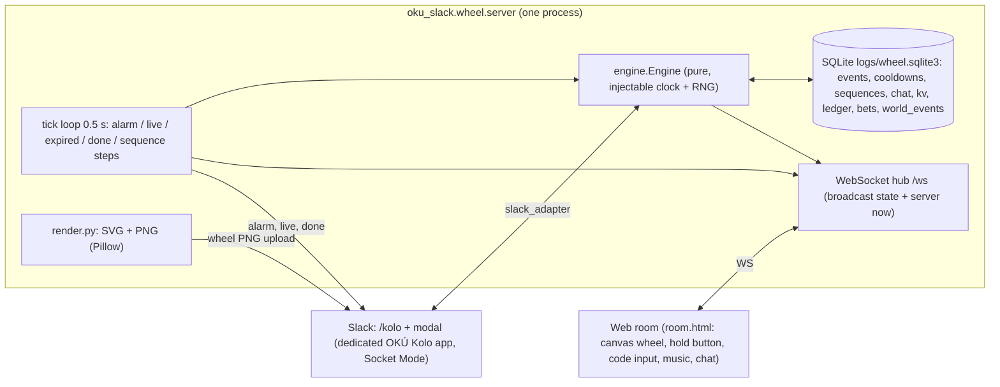

# OKÚ Wheel of Fortune ("kolo") + roomka

One Python service (`oku_slack.wheel.server`, aiohttp) holds all authoritative state; Slack and the web room are thin clients.
Separate from the live persona bridge (`oku_slack.bridge`, Heimdall `oku_slack`): own venv `.venv-wheel`, own process, own Slack app.

## Architecture



| Module | Role |
|---|---|
| `players.toml` | players (Kore, ICIK), timings, wheel events (OKÚ personas as hosts) |
| `oku_slack/wheel/engine.py` | spin, confirmation (code / server-timed hold), 5-min alarm, event state machine, 30-min cooldown, 2-min sequence, chat, snapshot |
| `oku_slack/wheel/store.py` | SQLite persistence (cooldowns survive restarts) |
| `oku_slack/wheel/render.py` | wheel SVG + PNG; same geometry as the room canvas |
| `oku_slack/wheel/server.py` | aiohttp app: `/` room, `/ws`, `/api/state`, `/wheel.png`, tick loop |
| `oku_slack/wheel/slack_adapter.py` | `/kolo` command, code modal, channel notifications |
| `manifests/kolo.yaml` | manifest for the dedicated Slack app (slash command, interactivity) |
| `oku_slack/world/` | world layer (P-001): append-only diary `world_events` (`log.py`), read-only projection (`state.py`), Czech surfaces (`view.py`) |

## Rules
- **Spin**: weighted random event; the server picks `target_angle` inside the winning segment, `turns`, `spin_at`. One active event at a time.
- **Confirmation**: event goes `pending -> ready` once `confirm_quorum` players confirmed (`players.toml [settings]`, default **1** = any one player, decision D1; `0` = all players). Other players may still confirm (join) while it is `ready`; re-confirming is a no-op. Deliberate only: type the 4-char event code (room or Slack modal) or press-and-hold in the room; the hold is measured by the server between `hold_start` and `hold_end` (>= `hold_min_s`, 2 s). Client timing is ignored.
- **Start**: at `start_at` (spin + `lead_s`, 10 min) if ready; if the quorum is reached later, it starts on the next tick; quorum not reached by `start_at + confirm_wait_s` -> `expired`.
- **Alarm**: once, `alarm_before_s` (300 s) before `start_at`; Slack message mentions all players.
- **Charged command**: per player, once per `cooldown_s` (1800 s), stored in SQLite; starts a 120 s server-timed sequence (steps at 0/30/60/90/110 s).
- **Room sync**: every WS message carries the full snapshot + server `now`; clients compute `offset = server_now - local_now`. Spin angle is `(turns*360 + target_angle) * easeOutCubic((now - spin_at)/spin_ms)`, so all clients show the same spin. Music starts at offset `now - live_at` (URL via `<audio>.currentTime`, or a built-in synthesized loop when `music_url` is empty).
- **Room auth**: `?p=<player>&k=<room_key>`; without them the client is a read-only spectator and never receives the code.

## Run
```powershell
cd C:\code\oku-slack
.\scripts\run-wheel-room.ps1            # creates .venv-wheel on first run, opens http://127.0.0.1:8797/?p=kore&k=kore-local
.\scripts\run-wheel-room.ps1 -Test      # full test suite (.venv-wheel; the bridge .venv has no Pillow)
.\scripts\run-wheel-room.ps1 -Slack     # also connect the OKÚ Kolo app (env SLACK_OKU_WHEEL_BOT_TOKEN / SLACK_OKU_WHEEL_APP_TOKEN)
```
ICIK: `http://<host>:8797/?p=icik&k=icik-local`. Env: `OKU_WHEEL_CONFIG`, `OKU_WHEEL_DB`, `OKU_WHEEL_HOST`, `OKU_WHEEL_PORT`, `OKU_WHEEL_PUBLIC_URL` (link used in Slack messages).

## Slack
- The Slack experience is ONE persistent control panel message (`panel.py`, kv `panel_ts`) in `slack_channel`: drums -> pre-rendered spin GIF -> result card, buttons 🎡 Točit / ✅ Potvrdit účast / ⚡ Nabitý příkaz / overflow (ℹ️ Stav, 🌍 Stav světa). The only separate channel post is the 5-minute alarm.
- `/kolo` (panel), `/kolo toc`, `/kolo sazka <klíč> <částka|all>`, `/kolo potvrdit` (modal with code), `/kolo prikaz`, `/kolo zebricek`, `/kolo stav`, `/kolo svet` (world state, ephemeral). Subcommands are parsed in code; the Slack app only registers `/kolo`.
- Panel resilience: soft errors (`not_in_channel`, `ratelimited`, ...) wait 120 s; other errors back off exponentially per repeated code (1, 2, 4 ... capped at 300 s) and log Slack's `response_metadata.messages`. After 3 consecutive `invalid_blocks` the panel renders text-only (no image blocks) for 10 min. A freshly uploaded result card is referenced (`slack_file`) only 3 s after upload; until then (and if Slack refuses it) the static card URL is used.

## Public room
- Static room: `https://www.itzkore.cz/oku/kolo/` (`scripts/deploy-wheel-room.ps1`, FTP). WebSocket: `wss://kolo-ws.itzkore.cz/ws` through the named Cloudflare tunnel (Heimdall `oku_wheel_tunnel`, `kolo-ws.itzkore.cz` -> 127.0.0.1:8797). Real `room_key`s live in the untracked `players.local.toml`.
- The tunnel forwards EVERY path on :8797. `/api/state` is public on purpose (room feed, the code is stripped). New routes must be loopback-only: `/api/world` returns 403 unless the peer is local AND no proxy header (`CF-Connecting-IP`, `X-Forwarded-For`, ...) is present (`server.loopback_only`).
- Music: only the built-in synthesized cue is shipped; any `music_url` must be licensed.

## Host announcer: Monika Babišová
`oku_slack/wheel/host.toml` holds random line pools (`spin`, `result`, `alarm`, `nag`, `expiry`, `legendary`) with placeholders `{title} {who} {time} {missing}`.
The engine stores the latest line on the event (`host_say`); the room shows it in the host bubble, Slack messages prefix it.
Triggers: spin (or `legendary`), `reveal` after the spin animation (`spin_ms`), alarm (5 min), `nag` once `nag_before_s` before start if someone is missing, expiry.

## Legendary event: Mimořádná schůze sněmovny / Titanic scéna
- `players.toml` event `snemovna` (`legendary = true`, `script = "titanic"`, `weight = 0.15`, tunable; 0 = never).
- Force for testing (only with `settings.allow_force = true`): `/kolo toc snemovna`, room button "Vynutit legendu", `Engine.spin(force="snemovna")`. Production has `allow_force = false` (D10); the room hides the button unless `/api/state` reports `settings.allow_force`. Tests enable force via `tests/conftest.py`.
- Script: `oku_slack/wheel/events/titanic.toml` (12 timed beats: `at`, `visual`, `music`, `caption`, `direction`, `lines`), credits + Marty quote.
- Cinematic state is server-authoritative: `Engine.cinematic()` = beat for `now - live_at`; tick emits `beat` notifications; snapshot carries `cinematic` + `script_data`.
  Clients draw the same beat from the shared server clock (canvas overlay: parliament benches, ship bow, sunset, waves, iceberg, PŘÍMÝ PŘENOS badge, lower third, confetti, credits). Characters are flat silhouettes with name tags only.
- Slack: during the legend the panel switches to "PŘÍMÝ PŘENOS" (static `titanic.png` + current beat); `GET /poster.png` renders the Pillow poster on demand.

## Heimdall
`C:\code\heimdall\services.d\oku_wheel.toml` (`autostart = true`, health `GET /api/state`), plus `oku_wheel_tunnel.toml` (named tunnel `kolo-ws.itzkore.cz` -> :8797, autostart).
Apply code/config changes with `heimdall restart oku_wheel`. Redeploy the static room (`scripts/deploy-wheel-room.ps1`) only when `room.html` or the images change.

## Slack canvas + spin GIF
- `canvas.py`: channel canvas "OKÚ Kolo · živě" in `slack_channel` (conversations.canvases.create; if the channel already has one, a standalone canvas shared read-only to the channel). Id stored in SQLite `kv.canvas_id`, reused after restart.
  Full rewrite (canvases.edit replace) on state changes, max 1 edit / 3 s, plus a 60 s refresh (countdown, cooldowns). Content: event + state + start, per-player confirmation, Monika's latest line, Titanic beat (caption, direction, lines) during a legendary event, charged-command cooldowns, active sequence step, "🌍 Stav světa" (resources, blame, live/spun, last outcomes), last 10 room chat messages. The event code is never put in the canvas.
  Slack errors (missing_scope, not_in_channel, ...) are logged by code with a 5 min backoff; the service keeps running.
- `render.spin_gif`: 40 frames, 420 px, ease-out identical to the room, blinking marquee bulbs, adaptive palette per frame, last frame = result with banner (2.2 s), ~1.7 MB. Pre-rendered per segment by `deploy-wheel-room.ps1` and shown in the panel (`kolo-spin-<key>.gif`).
- `render.png`: 800 px, 3x supersampled: radial-gradient segments, gold rim with marquee bulbs, glossy OKÚ hub, pointer with shadow, stage spotlight, Czech labels (Segoe UI Bold).
- Bot scopes (manifests/kolo.yaml): commands, chat:write, files:write, files:read, canvases:write, canvases:read.

## Wheel v2: persona scenes, OKÚ korun + bets, charged effects, live show

```mermaid
sequenceDiagram
  autonumber
  participant P as Player (Slack panel)
  participant K as OKÚ Kolo app (Socket Mode)
  participant E as engine (tick 0.5 s, lock)
  participant DB as SQLite (ledger, bets, kv)
  participant S as SceneRunner
  participant B as Persona bots (Web API only)
  P->>K: 🎡 Točit
  K->>E: open_bets (bet_window_s = 30 s)
  P->>K: select segment + 50/100/250/All-in
  K->>E: bet (stake escrowed)
  E->>DB: ledger -stake, bets row
  E-->>E: window closes -> spin(round_id)
  E-->>DB: reveal -> settle (stake x odds, x2 if double_bet)
  P->>K: ✅ confirm (code modal) (+50 if in time)
  E-->>S: live -> plan scene (4-8 beats / Titanic script)
  S->>B: beat 1 top-level (short), rest in its thread
  Note over S,B: line = core.build_prompt(persona) + core.generate (Gemini, same keys as the bridge); template fallback
  P->>K: ⚡ Nabitý příkaz
  K->>E: use_command -> effects registry
  E-->>S: persona_line (Babiš interrupts / Kalousek one-liner)
  P->>K: poll / 💸 Chyť dotaci / 🧠 quiz
  K->>E: vote / catch / quiz (+points)
  B-->>K: reaction_added / removed on panel + scene messages
  K->>E: hype ±1
```

| Module | Role |
|---|---|
| `economy.py` | balances (`start_points` + ledger), weight-based odds (`total/weight * (1-house_edge)`, min `min_odds`), bets (escrow, settle, refund), leaderboard |
| `effects.py` | charged-command effect registry: `veto_respin`, `steal_points`, `double_bet`, `persona_interrupt`, `shield` |
| `show.py` | live show state on the event: poll, `Chyť dotaci` (first click in a `catch_window_s` window), 3-option OKÚ quiz, hype meter |
| `scenes.py` + `scenes.toml` | persona scene per event key (premise + 4-8 beats with cue + fallback), timing, LLM generation, resume after restart |
| `personas.py` | posting as persona bots (`SLACK_OKU_<KEY>_BOT_TOKEN`, Babiš also `SLACK_OKU_BOT_TOKEN`), fallback narration by the wheel bot |

### Points, bets, leaderboard
- Every player starts with `start_points` (1000) OKÚ korun. Every change is a `ledger` row (auditable); bets live in `bets`.
- **Točit** opens a `bet_window_s` (30 s) betting round (panel: countdown, segment select with odds, 💰 50 / 100 / 250 / 💥 All-in).
  When the window closes the tick spins; bets are settled at the reveal. `/kolo toc <key>` (forced, testing) spins immediately without bets.
- Points also for: confirming before the start (`points_confirm`), first poll vote (`points_vote`), catching the subsidy (`points_catch`), correct quiz answer (`points_quiz`).
- Leaderboard (top 5) is always in the panel; `/kolo zebricek`. `/kolo sazka <key> <amount|all>` bets from the command line.

### Charged commands (30-min cooldown kept)
`players.<p>.command_effects` + `command_persona` in `players.toml`. A command is accepted when at least one effect applies (else the cooldown is not spent).
The 2-min sequence narrates the effects live in the panel (`Sekvence` field).
- Kore "Sorry jako": `veto_respin` (cancels the current not-yet-live result, refunds unrevealed stakes, respins) + `persona_interrupt` (Babiš jumps in).
- ICIK "Kalousek za to může": `steal_points` (`steal_pct` % of the leader's balance; the richest other player if ICIK leads; blocked by `shield`), Kalousek posts a one-liner.

### Persona scenes
- On `live`, `SceneRunner` posts the scene: the first beat is a short top-level line in the wheel channel, the rest go into its thread.
- Each line: persona prompt via `oku_slack.core.build_prompt` (same persona files as the bridge) + `core.generate` (Gemini; env `LLM_BACKEND`, `OKU_GEMINI_ENV_FILE` like the bridge's Heimdall service).
  Transcript so far + any running charged sequence go into the prompt. Error, empty answer, or more than `scene_llm_timeout_s` -> the beat's templated `fallback`.
- Titanic legend: fixed script lines; `turek` -> Bourák bot, `marty` -> Marty bot, `macinka` -> Peťa bot (`SLACK_OKU_PETA_BOT_TOKEN`; config.toml alias), `monika` -> wheel bot. Without a persona token the wheel bot posts the line (`username` override if `chat:write.customize` is granted, else narrated by Monika).
- Loop safety: persona posts are bot messages; `oku_slack.bridge.ignored()` drops every event with `bot_id`/`subtype` (both `app_mention` and `message`), so the bridge never answers them and the meeting "porada" trigger never fires on them. Mentions (`<@…>`, `<!…>`) are stripped from generated lines.
- Persona bots are already members of #oku-porada; a bot that is missing/refused degrades to wheel-bot narration.

### Slack app changes (A0C7EUMGZ98, manifests/kolo.yaml)
- Bot scopes: `reactions:read` (hype meter), `chat:write.customize` (optional name override).
- Event subscriptions (bot events): `reaction_added`, `reaction_removed`. Reinstall the app after the change.
- Until granted: the hype meter stays at 0 and wheel-bot lines are narrated; everything else works. Granted scopes are read from the `x-oauth-scopes` header of `auth.test` at start and re-checked every 5 min (name override switches on live). Reaction handlers are always registered, so events flow over the existing Socket Mode connection as soon as the app is reinstalled with the subscription; no code change or restart is needed (restart only to log the new scopes immediately).

## OKÚ World layer (P-001: diary + read-only state)
Plan: `docs/ECOSYSTEM-PLAN.md`. Runs inside the `oku_wheel` process (D2). P-001 adds **no channel posts** and **no consequences**.
- **Diary** (`oku_slack/world/log.py`): append-only SQLite table `world_events` in `logs/wheel.sqlite3` + JSONL mirror `logs/world.jsonl` (env `OKU_WORLD_JSONL`). Envelope: `id` (`we_0001`), `seq`, `ts`, `type`, `source` (`engine` / `slack` / `room` / `backfill`), `actor`, `subject` (`event:<id>`, `round:<id>`), `payload`, `causal_parents` (default: the first row about the same subject, i.e. the spin), `regime`, `content_version` (git sha), `run_id`. Free text (chat, slash args) is never stored, only types/ids/lengths. A diary failure is logged and never breaks the wheel.
- Types: `wheel.spin|reveal|confirm|ready|alarm|nag|live|done|expired|vetoed`, `bets.open`, `bet.placed`, `bet.settled`, `bets.refunded`, `effect.double_used`, `command.used`, `show.vote|catch|quiz`, `reaction` (tracked panel/scene messages; emoji name, delta, hype applied), `room.chat` (length only), `ui.kolo` (`/kolo` subcommand name + `slash`/`button`).
- **Backfill**: on start, if the diary is empty, pre-P-001 history (events, bets, sequences tables) is imported once with `source=backfill` (kv `world:backfilled`).
- **Projection** (`oku_slack/world/state.py`): pure fold `project(events, ctx)`; incremental cache equals a rebuild from scratch (tested). Resources Dotace 5 000 / Kampaň 35 (0-100) / Hranolky 80 (0-200) / Lajky 1 200 are seeds (`world_<key>` settings override) and only change through `world.delta` rows, which nothing writes until P-002. Read-only interpretation: blame +1 for each player missing an `expired` event and for a `veto`, +1 to the command persona (Kalousek) for a successful `steal_points`; witnessed acts per player per persona (host persona of the event, or the command persona); per-player stats; per-persona event counts; 7-day metrics. `World.snapshot()` also stores kv `world:snapshot`.
- **Surfaces**: `/kolo svet` (ephemeral), panel overflow "🌍 Stav světa", one panel context line under the leaderboard, canvas section "🌍 Stav světa". Loopback-only `GET /api/world[?events=N]` for local inspection.
